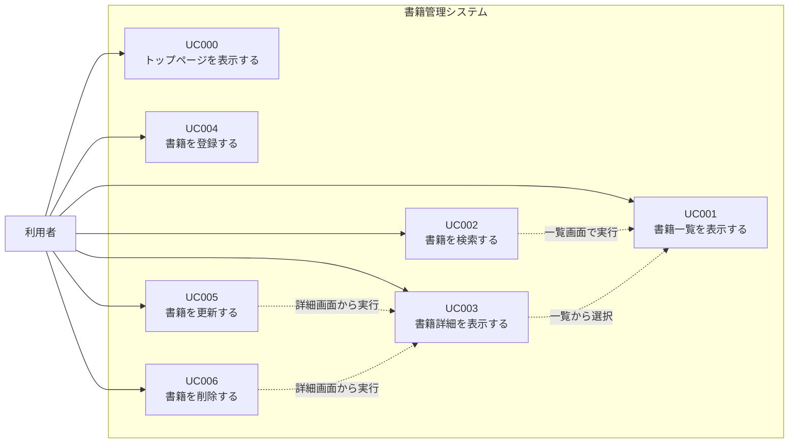
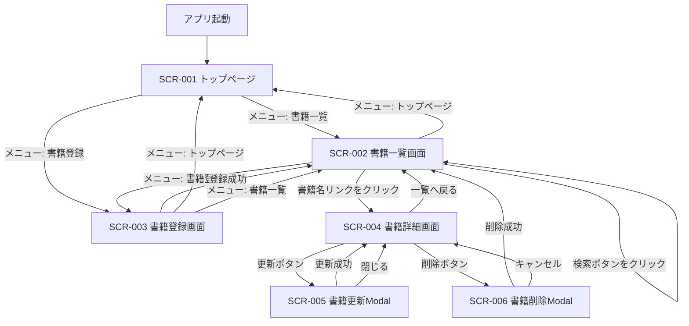
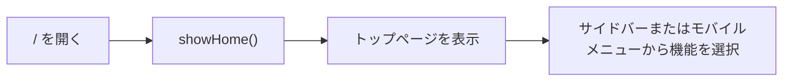
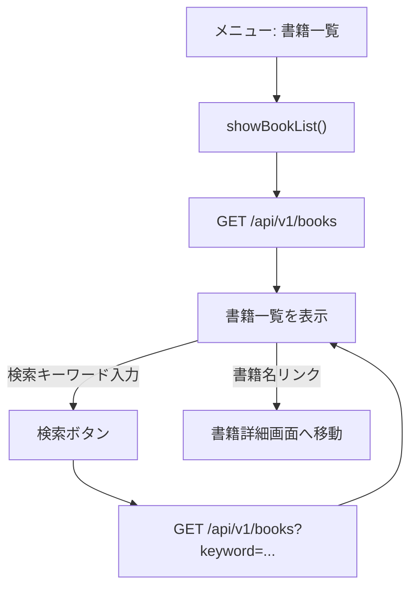
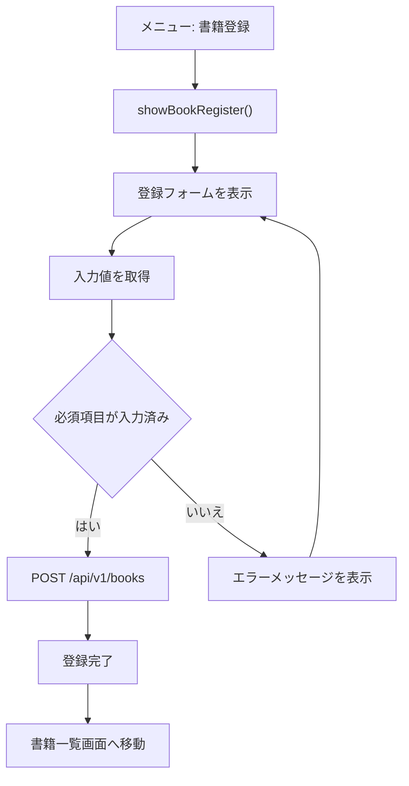
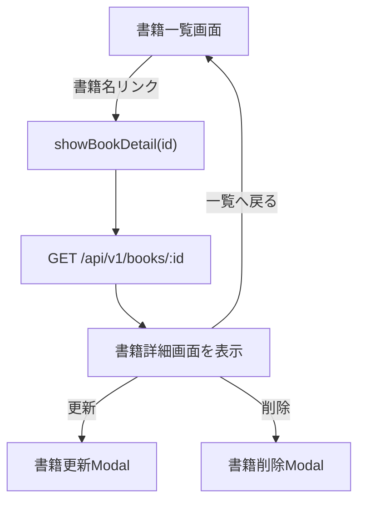
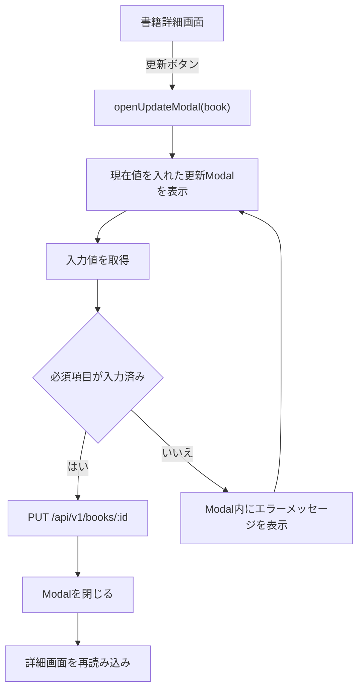
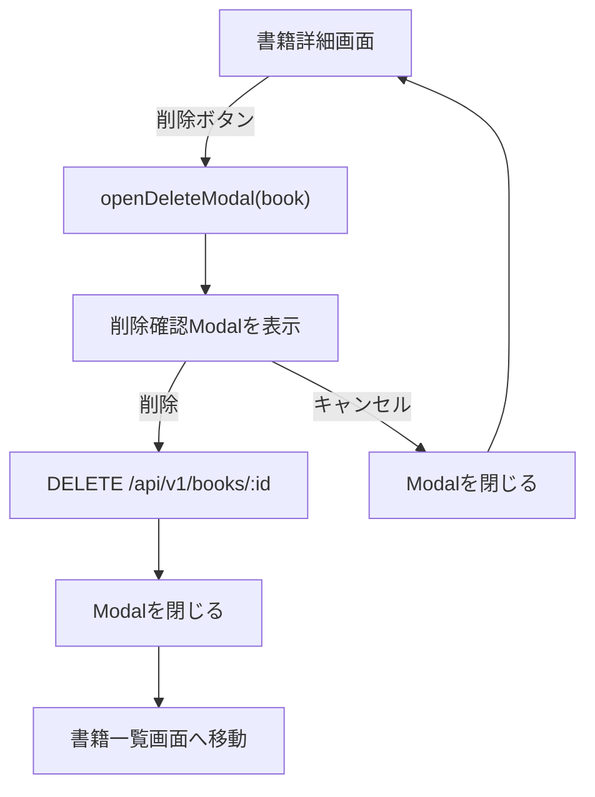

# SPA入門 総合演習ガイド

## 書籍管理システム

この総合演習では、SPA入門で学習した内容を使い、書籍情報を管理するSPAを作成します。

題材は「書籍管理システム」です。メインテキストでは `products` テーブルを使った商品管理、演習ガイドでは `employee` テーブルを使った社員管理を扱いました。本演習では、それらの実装パターンを `books` テーブルへ置き換えて実装します。

## 1. 演習概要

### 1.1 目的

HTML、CSS、JavaScript、Axios、Express、SQLite、Modal、Navigation APIを組み合わせ、画面遷移を伴わない書籍管理SPAを実装できるようになることを目的とします。

### 1.2 作成する機能

| 機能ID | 機能名 | 概要 | 表現方法 |
|---|---|---|---|
| FUNC-000 | トップページ表示 | システム概要と操作案内を表示する | 疑似画面 |
| FUNC-001 | 書籍一覧表示 | 登録済み書籍を一覧表示する | 疑似画面 |
| FUNC-002 | 書籍検索 | 書籍名のキーワードで一覧を絞り込む | 一覧画面内 |
| FUNC-003 | 書籍詳細表示 | 選択した書籍の詳細情報を表示する | 疑似画面 |
| FUNC-004 | 書籍新規登録 | 新しい書籍情報を登録する | 疑似画面 |
| FUNC-005 | 書籍情報更新 | 登録済み書籍情報を変更する | Modal |
| FUNC-006 | 書籍削除 | 登録済み書籍情報を削除する | Modal |

基本機能のトップページでは、サイドバーと同じリンクを並べるのではなく、システム概要と簡単な操作案内を表示します。機能への移動は、共通レイアウトのサイドバーまたはモバイルメニューから行います。

追加機能の候補として、トップページに登録書籍数と最近登録された書籍を表示するダッシュボード機能を用意します。

| 追加機能ID | 追加機能名 | 概要 |
|---|---|---|
| ADD-001 | トップページ情報表示 | 登録書籍数と最近登録された書籍をトップページに表示する |
| ADD-002 | ログイン機能 | ユーザーIDとパスワードでログインできるようにする |
| ADD-003 | 権限管理 | `role` によって利用できる機能を制御する |

### 1.3 使用技術

| 分類 | 使用技術 | 備考 |
|---|---|---|
| フロントエンド | HTML / CSS / JavaScript | 素のJavaScriptで実装 |
| 非同期通信 | Axios | CDNから読み込み |
| SPA制御 | Navigation API | URLと画面表示を対応させる |
| UI部品 | Modal / ボタン / Offcanvas | テキストで扱った範囲だけ使用 |
| バックエンド | Node.js / Express | REST APIを作成 |
| データベース | SQLite | `books.db` を使用 |

## 2. 演習の進め方

### 2.1 開発手順

1. スターターキットの構成を確認する。
2. トップページの役割を確認する。
3. `books` テーブルと初期データを確認する。
4. Expressで書籍管理APIを作成する。
5. Navigation APIでURLと画面を対応させる。
6. 書籍一覧画面を作成する。
7. 書籍検索を追加する。
8. 書籍詳細画面を作成する。
9. 書籍登録画面を作成する。
10. 書籍更新Modalを作成する。
11. 書籍削除Modalを作成する。
12. JavaScriptファイルをコンポーネント単位で整理する。
13. 動作確認を行う。

トップページはスターターキットに実装済みの `showHome()` を確認するところから始めます。基本機能では、トップページをAPI通信の対象にはしません。登録書籍数や最近登録された書籍の表示は、追加機能として後から実装します。

### 2.2 提供物

| 提供物 | 内容 |
|---|---|
| `BookProject/index.html` | ヘッダー、フッター、サイドバー、モバイルメニュー、`<main id="app">` を実装済み |
| `BookProject/css/style.css` | 画面レイアウトと書籍管理用classを定義済み |
| `BookProject/js/app.js` | `showHome()` のみ接続済み |
| `BookProject/js/components/home.js` | トップページのみ実装済み |
| `BookProject/images/` | 書籍画像ファイル |
| `BookProject/db/books.sql` | `books` テーブル作成SQLと初期データ |
| `BookProject/api/` | Express API作成用フォルダ |
| `BookProject/api/node_modules/` | 依存パッケージをインストール済み |

### 2.3 作成する主なファイル

| ファイル | 役割 |
|---|---|
| `api/server.js` | Express APIとHTML配信を実装 |
| `js/components/book-list.js` | 書籍一覧・検索画面 |
| `js/components/book-detail.js` | 書籍詳細画面 |
| `js/components/book-register.js` | 書籍登録画面 |
| `js/components/book-update-modal.js` | 書籍更新Modal |
| `js/components/book-delete-modal.js` | 書籍削除Modal |

## 3. ユースケース

### 3.1 ユースケース概要

書籍管理システムでは、書籍情報を一覧表示し、必要に応じて検索、詳細確認、登録、更新、削除を行います。

本システムの基本機能では、ログイン機能や権限管理は実装対象外とします。ただし、追加機能の候補としてログイン機能と権限管理を想定しているため、後続の追加機能仕様で扱います。

### 3.2 アクター

| アクター | 説明 |
|---|---|
| 利用者 | 書籍情報を管理する人。書籍の一覧確認、検索、詳細確認、登録、更新、削除を行う。 |

### 3.3 ユースケース一覧

| ユースケースID | ユースケース名 | 概要 | 対応機能 |
|---|---|---|---|
| UC000 | トップページを表示する | システム概要と操作案内を確認する。 | FUNC-000 |
| UC001 | 書籍一覧を表示する | 登録済みの書籍を一覧で確認する。 | FUNC-001 |
| UC002 | 書籍を検索する | 書籍名のキーワードで一覧を絞り込む。 | FUNC-002 |
| UC003 | 書籍詳細を表示する | 一覧で選択した書籍の詳細情報を確認する。 | FUNC-003 |
| UC004 | 書籍を登録する | 新しい書籍情報を登録する。 | FUNC-004 |
| UC005 | 書籍を更新する | 登録済みの書籍情報を変更する。 | FUNC-005 |
| UC006 | 書籍を削除する | 登録済みの書籍情報を削除する。 | FUNC-006 |

### 3.4 ユースケース図

## 4. ユースケース仕様書

### UC000 トップページを表示する

| 項目 | 内容 |
|---|---|
| ユースケースID | UC000 |
| ユースケース名 | トップページを表示する |
| アクター | 利用者 |
| 目的 | システムの概要と基本的な操作方針を確認できるようにする。 |
| トリガー | 利用者がブラウザで `/` にアクセスする。または、サイドバーやモバイルメニューの「トップページ」をクリックする。 |
| 事前条件 | APIサーバーが起動している。 |
| 事後条件 | トップページが表示される。 |
| 対応画面 | トップページ |
| 対応URL | `/` |
| 対応API | なし |
| 対応ファイル | `js/components/home.js`, `js/app.js` |

#### 基本フロー

1. 利用者が `/` にアクセスする。
2. `app.js` がURL `/` を判定し、`showHome()` を呼び出す。
3. `showHome()` がトップページのHTMLを作成する。
4. `id="app"` の要素にトップページを表示する。
5. 利用者は画面の説明を読み、サイドバーまたはモバイルメニューから操作を選択する。

#### 代替フロー・例外フロー

| 条件 | 処理 |
|---|---|
| `/index.html` にアクセスした場合 | `/` と同じトップページを表示する。 |
| モバイル幅で表示した場合 | サイドバーの代わりに三本線ボタンからモバイルメニューを開く。 |

#### 表示項目

| 項目 | 表示内容 |
|---|---|
| システム名 | 書籍管理システムであることを表示する。 |
| システム概要 | 書籍情報の一覧、検索、登録、更新、削除を行うシステムであることを説明する。 |
| 操作案内 | 具体的な機能選択はサイドバーまたはモバイルメニューから行うことを案内する。 |

#### 動作確認

| 確認内容 | 期待結果 |
|---|---|
| `/` にアクセスする | トップページが表示される。 |
| 「トップページ」をクリックする | トップページが表示される。 |
| トップページからサイドバーを確認する | 書籍一覧、書籍登録へ移動できるメニューが表示されている。 |

#### 追加機能候補

| 追加機能 | 内容 |
|---|---|
| 登録書籍数表示 | `books` テーブルの件数を取得し、トップページに表示する。 |
| 最近登録された書籍表示 | 登録順の新しい書籍を数件取得し、トップページに表示する。 |

### UC001 書籍一覧を表示する

| 項目 | 内容 |
|---|---|
| ユースケースID | UC001 |
| ユースケース名 | 書籍一覧を表示する |
| アクター | 利用者 |
| 目的 | 登録済みの書籍を一覧で確認できるようにする。 |
| トリガー | 利用者がサイドバーまたはモバイルメニューの「書籍一覧」をクリックする。または、ブラウザで `/books` にアクセスする。 |
| 事前条件 | APIサーバーが起動している。`books` テーブルが存在している。 |
| 事後条件 | 書籍一覧画面が表示される。登録済みの書籍が0件の場合は、0件であることが分かる表示になる。 |
| 対応画面 | 書籍一覧画面 |
| 対応URL | `/books` |
| 対応API | `GET /api/v1/books` |
| 対応ファイル | `js/components/book-list.js`, `api/server.js` |

#### 基本フロー

1. 利用者が「書籍一覧」を選択する。
2. `app.js` がURL `/books` を判定し、`showBookList()` を呼び出す。
3. `showBookList()` が `GET /api/v1/books` をAxiosで呼び出す。
4. APIが `books` テーブルから書籍情報を取得する。
5. APIが書籍情報の配列をJSONで返す。
6. 画面側で取得した配列を1件ずつHTML文字列に変換する。
7. 書籍一覧を画面に表示する。

#### 代替フロー・例外フロー

| 条件 | 処理 |
|---|---|
| 書籍が0件の場合 | 一覧テーブルを空にするだけではなく、「登録されている書籍はありません。」などのメッセージを表示する。 |
| API通信に失敗した場合 | コンソールにエラーを出力し、画面には「書籍一覧を取得できませんでした。」と表示する。 |

#### 表示項目

| 項目 | 表示内容 |
|---|---|
| 画像 | `image_path` を使い、書籍の表紙画像を表示する。 |
| 書籍ID | `id` を表示する。 |
| 書籍名 | `title` を表示する。詳細画面へ移動するリンクにする。 |
| 著者名 | `author` を表示する。 |
| 価格 | `price` を表示する。 |
| 出版社 | `publisher` を表示する。 |

#### 動作確認

| 確認内容 | 期待結果 |
|---|---|
| `/books` にアクセスする | 書籍一覧画面が表示される。 |
| 初期データがある状態で表示する | 複数の書籍が一覧に表示される。 |
| 書籍名リンクをクリックする | ページ全体を再読み込みせず、詳細画面へ移動する。 |

### UC002 書籍を検索する

| 項目 | 内容 |
|---|---|
| ユースケースID | UC002 |
| ユースケース名 | 書籍を検索する |
| アクター | 利用者 |
| 目的 | 書籍名の一部を使って、目的の書籍を探しやすくする。 |
| トリガー | 利用者が検索欄にキーワードを入力し、「検索」ボタンをクリックする。 |
| 事前条件 | 書籍一覧画面が表示されている。 |
| 事後条件 | 入力したキーワードに一致する書籍だけが一覧に表示される。 |
| 対応画面 | 書籍一覧画面 |
| 対応URL | `/books` |
| 対応API | `GET /api/v1/books?keyword=キーワード` |
| 対応ファイル | `js/components/book-list.js`, `api/server.js` |

#### 基本フロー

1. 利用者が検索欄にキーワードを入力する。
2. 利用者が「検索」ボタンをクリックする。
3. 画面側で検索欄の値を取得する。
4. `GET /api/v1/books?keyword=キーワード` をAxiosで呼び出す。
5. APIが `title LIKE ?` を使って書籍名を部分一致検索する。
6. APIが検索結果の配列をJSONで返す。
7. 画面側で一覧の表示内容を検索結果に置き換える。

#### 代替フロー・例外フロー

| 条件 | 処理 |
|---|---|
| キーワードが空欄の場合 | 全件検索として扱い、すべての書籍を表示する。 |
| 検索結果が0件の場合 | 「条件に一致する書籍はありません。」と表示する。 |
| API通信に失敗した場合 | コンソールにエラーを出力し、画面には「検索に失敗しました。」と表示する。 |

#### 入力項目

| 項目 | 内容 |
|---|---|
| キーワード | 書籍名に含まれる文字列。空欄も許可する。 |

#### 動作確認

| 確認内容 | 期待結果 |
|---|---|
| 存在する書籍名の一部で検索する | 一致する書籍だけが表示される。 |
| 存在しないキーワードで検索する | 0件メッセージが表示される。 |
| 空欄で検索する | 全件が表示される。 |

### UC003 書籍詳細を表示する

| 項目 | 内容 |
|---|---|
| ユースケースID | UC003 |
| ユースケース名 | 書籍詳細を表示する |
| アクター | 利用者 |
| 目的 | 選択した書籍の詳細情報を確認できるようにする。 |
| トリガー | 利用者が書籍一覧画面で書籍名リンクをクリックする。 |
| 事前条件 | 対象の書籍が `books` テーブルに存在している。 |
| 事後条件 | 書籍詳細画面が表示される。 |
| 対応画面 | 書籍詳細画面 |
| 対応URL | `/books/{id}` |
| 対応API | `GET /api/v1/books/:id` |
| 対応ファイル | `js/components/book-detail.js`, `api/server.js` |

#### 基本フロー

1. 利用者が一覧画面の書籍名リンクをクリックする。
2. Navigation APIにより、URLが `/books/{id}` に変わる。
3. `app.js` がURLから書籍IDを取り出し、`showBookDetail(id)` を呼び出す。
4. `showBookDetail(id)` が `GET /api/v1/books/:id` をAxiosで呼び出す。
5. APIが `books` テーブルから該当する書籍を1件取得する。
6. APIが書籍オブジェクトをJSONで返す。
7. 画面側で書籍詳細を表示する。
8. 詳細画面に「更新」「削除」「一覧へ戻る」ボタンを表示する。

#### 代替フロー・例外フロー

| 条件 | 処理 |
|---|---|
| 対象IDの書籍が存在しない場合 | APIは404を返す。画面には「書籍情報を取得できませんでした。」と表示する。 |
| API通信に失敗した場合 | コンソールにエラーを出力し、一覧へ戻るボタンを表示する。 |

#### 表示項目

| 項目 | 表示内容 |
|---|---|
| 画像 | `image_path` を使い、表紙画像を表示する。 |
| 書籍ID | `id` を表示する。 |
| 書籍名 | `title` を表示する。 |
| 著者名 | `author` を表示する。 |
| 価格 | `price` を表示する。 |
| 出版社 | `publisher` を表示する。 |
| 画像パス | `image_path` を表示する。 |

#### 動作確認

| 確認内容 | 期待結果 |
|---|---|
| 一覧から書籍名をクリックする | 詳細画面が表示される。 |
| 詳細画面の「一覧へ戻る」をクリックする | 書籍一覧画面へ戻る。 |

### UC004 書籍を登録する

| 項目 | 内容 |
|---|---|
| ユースケースID | UC004 |
| ユースケース名 | 書籍を登録する |
| アクター | 利用者 |
| 目的 | 新しい書籍情報をシステムに追加する。 |
| トリガー | 利用者がサイドバーまたはモバイルメニューの「書籍登録」をクリックする。または、ブラウザで `/books/new` にアクセスする。 |
| 事前条件 | APIサーバーが起動している。 |
| 事後条件 | 入力した書籍情報が `books` テーブルに登録される。登録後、書籍一覧画面へ移動する。 |
| 対応画面 | 書籍登録画面 |
| 対応URL | `/books/new` |
| 対応API | `POST /api/v1/books` |
| 対応ファイル | `js/components/book-register.js`, `api/server.js` |

#### 基本フロー

1. 利用者が「書籍登録」を選択する。
2. `app.js` がURL `/books/new` を判定し、`showBookRegister()` を呼び出す。
3. 画面に書籍登録フォームを表示する。
4. 利用者が書籍名、著者名、価格、出版社、画像パスを入力する。
5. 利用者が「登録」ボタンをクリックする。
6. 画面側で入力値を取得する。
7. 必須項目である書籍名、著者名、価格が入力されているか確認する。
8. `POST /api/v1/books` をAxiosで呼び出す。
9. APIが `books` テーブルへ書籍情報を登録する。
10. APIが登録した書籍IDをJSONで返す。
11. 画面側で登録完了を通知する。
12. 書籍一覧画面へ移動する。

#### 代替フロー・例外フロー

| 条件 | 処理 |
|---|---|
| 書籍名、著者名、価格のいずれかが未入力の場合 | APIを呼び出さず、画面に「データを入力してください。」と表示する。 |
| API側で必須項目不足を検出した場合 | APIは400を返す。画面側はエラーを表示する。 |
| API通信に失敗した場合 | コンソールにエラーを出力し、登録画面に留まる。 |

#### 入力項目

| 項目 | 必須 | 入力例 | 備考 |
|---|---|---|---|
| 書籍名 | ○ | JavaScript入門 | `title` として送信する。 |
| 著者名 | ○ | 山田太郎 | `author` として送信する。 |
| 価格 | ○ | 2800 | `price` として送信する。 |
| 出版社 | - | サンプル出版 | `publisher` として送信する。 |
| 画像パス | - | `/images/1.png` | `image_path` として送信する。 |

#### 動作確認

| 確認内容 | 期待結果 |
|---|---|
| 必須項目を入力して登録する | 書籍が登録され、一覧画面へ移動する。 |
| 必須項目を空欄にして登録する | エラーメッセージが表示され、登録されない。 |
| 登録後に一覧画面を確認する | 登録した書籍が表示される。 |

### UC005 書籍を更新する

| 項目 | 内容 |
|---|---|
| ユースケースID | UC005 |
| ユースケース名 | 書籍を更新する |
| アクター | 利用者 |
| 目的 | 登録済みの書籍情報を変更する。 |
| トリガー | 利用者が書籍詳細画面で「更新」ボタンをクリックする。 |
| 事前条件 | 書籍詳細画面が表示されている。対象の書籍が `books` テーブルに存在している。 |
| 事後条件 | 入力した内容で `books` テーブルの該当レコードが更新される。更新後、詳細画面に最新情報が表示される。 |
| 対応画面 | 書籍詳細画面、書籍更新Modal |
| 対応URL | `/books/{id}` |
| 対応API | `PUT /api/v1/books/:id` |
| 対応ファイル | `js/components/book-detail.js`, `js/components/book-update-modal.js`, `api/server.js` |

#### 基本フロー

1. 利用者が書籍詳細画面を表示する。
2. 利用者が「更新」ボタンをクリックする。
3. `book-detail.js` が `openUpdateModal(book)` を呼び出す。
4. 更新Modalに現在の書籍情報を初期値として表示する。
5. 利用者が入力内容を変更する。
6. 利用者がModal内の「更新」ボタンをクリックする。
7. 画面側で入力値を取得する。
8. 必須項目である書籍名、著者名、価格が入力されているか確認する。
9. `PUT /api/v1/books/:id` をAxiosで呼び出す。
10. APIが `books` テーブルの該当レコードを更新する。
11. APIが更新完了メッセージをJSONで返す。
12. 画面側で更新完了を通知する。
13. Modalを閉じる。
14. 現在の詳細画面を再読み込みし、更新後の情報を表示する。

#### 代替フロー・例外フロー

| 条件 | 処理 |
|---|---|
| 必須項目が未入力の場合 | APIを呼び出さず、Modal内に「データを入力してください。」と表示する。 |
| 対象IDの書籍が存在しない場合 | APIは404相当のエラーを返す。画面側はエラーを表示する。 |
| API通信に失敗した場合 | コンソールにエラーを出力し、Modalを開いたままにする。 |

#### 入力項目

| 項目 | 必須 | 初期値 | 備考 |
|---|---|---|---|
| 書籍名 | ○ | 現在の `title` | 変更可能。 |
| 著者名 | ○ | 現在の `author` | 変更可能。 |
| 価格 | ○ | 現在の `price` | 変更可能。 |
| 出版社 | - | 現在の `publisher` | 変更可能。 |
| 画像パス | - | 現在の `image_path` | 変更可能。 |

#### 動作確認

| 確認内容 | 期待結果 |
|---|---|
| 詳細画面で更新ボタンを押す | 更新Modalが表示され、現在値が入力済みになっている。 |
| 値を変更して更新する | Modalが閉じ、詳細画面に更新後の情報が表示される。 |
| 必須項目を空欄にして更新する | Modal内にエラーメッセージが表示され、更新されない。 |

### UC006 書籍を削除する

| 項目 | 内容 |
|---|---|
| ユースケースID | UC006 |
| ユースケース名 | 書籍を削除する |
| アクター | 利用者 |
| 目的 | 不要になった書籍情報を削除する。 |
| トリガー | 利用者が書籍詳細画面で「削除」ボタンをクリックする。 |
| 事前条件 | 書籍詳細画面が表示されている。対象の書籍が `books` テーブルに存在している。 |
| 事後条件 | 対象の書籍情報が `books` テーブルから削除される。削除後、書籍一覧画面へ移動する。 |
| 対応画面 | 書籍詳細画面、書籍削除Modal |
| 対応URL | `/books/{id}` |
| 対応API | `DELETE /api/v1/books/:id` |
| 対応ファイル | `js/components/book-detail.js`, `js/components/book-delete-modal.js`, `api/server.js` |

#### 基本フロー

1. 利用者が書籍詳細画面を表示する。
2. 利用者が「削除」ボタンをクリックする。
3. `book-detail.js` が `openDeleteModal(book)` を呼び出す。
4. 削除確認Modalに削除対象の書籍名を表示する。
5. 利用者がModal内の「削除」ボタンをクリックする。
6. `DELETE /api/v1/books/:id` をAxiosで呼び出す。
7. APIが `books` テーブルから該当レコードを削除する。
8. APIが削除完了メッセージをJSONで返す。
9. 画面側で削除完了を通知する。
10. Modalを閉じる。
11. 書籍一覧画面へ移動する。

#### 代替フロー・例外フロー

| 条件 | 処理 |
|---|---|
| 利用者が「キャンセル」または閉じるボタンをクリックした場合 | Modalを閉じる。削除APIは呼び出さない。 |
| 対象IDの書籍が存在しない場合 | APIはエラーを返す。画面側はエラーを表示する。 |
| API通信に失敗した場合 | コンソールにエラーを出力し、Modalを開いたままにする。 |

#### 表示項目

| 項目 | 表示内容 |
|---|---|
| 確認メッセージ | 「{書籍名} を削除してもよろしいですか？」 |
| 削除ボタン | 削除処理を実行する。 |
| キャンセルボタン | 削除せずModalを閉じる。 |

#### 動作確認

| 確認内容 | 期待結果 |
|---|---|
| 詳細画面で削除ボタンを押す | 削除確認Modalが表示される。 |
| キャンセルする | Modalが閉じ、書籍は削除されない。 |
| 削除を確定する | 書籍が削除され、一覧画面へ移動する。 |
| 削除後に一覧を確認する | 削除した書籍が表示されない。 |

### 4.1 ユースケースと実装ファイルの対応

| ユースケース | フロントエンド | バックエンド |
|---|---|---|
| UC000 トップページを表示する | `home.js` | なし |
| UC001 書籍一覧を表示する | `book-list.js` | `GET /api/v1/books` |
| UC002 書籍を検索する | `book-list.js` | `GET /api/v1/books?keyword=xxx` |
| UC003 書籍詳細を表示する | `book-detail.js` | `GET /api/v1/books/:id` |
| UC004 書籍を登録する | `book-register.js` | `POST /api/v1/books` |
| UC005 書籍を更新する | `book-update-modal.js` | `PUT /api/v1/books/:id` |
| UC006 書籍を削除する | `book-delete-modal.js` | `DELETE /api/v1/books/:id` |

## 5. 画面一覧およびUIフロー図

### 5.1 画面一覧

本システムは、`index.html` の共通レイアウトを残したまま、`<main id="app">` の中身だけを切り替えるSPAとして作成します。

| 画面ID | 画面名 | URL | 表示関数 | 表示方式 | 主な役割 | 遷移・表示方法 |
|---|---|---|---|---|---|---|
| SCR-001 | トップページ | `/` | `showHome()` | 疑似画面 | システム概要と操作案内を表示する。 | ブラウザで `/` を開く。またはメニューの「トップページ」をクリックする。 |
| SCR-002 | 書籍一覧画面 | `/books` | `showBookList()` | 疑似画面 | 書籍一覧表示と書籍名検索を行う。 | メニューの「書籍一覧」をクリックする。 |
| SCR-003 | 書籍登録画面 | `/books/new` | `showBookRegister()` | 疑似画面 | 新しい書籍情報を登録する。 | メニューの「書籍登録」をクリックする。 |
| SCR-004 | 書籍詳細画面 | `/books/{id}` | `showBookDetail(id)` | 疑似画面 | 選択した書籍の詳細情報を表示する。 | 書籍一覧画面の書籍名リンクをクリックする。 |
| SCR-005 | 書籍更新Modal | なし | `openUpdateModal(book)` | Modal | 登録済み書籍の情報を変更する。 | 書籍詳細画面の「更新」ボタンをクリックする。 |
| SCR-006 | 書籍削除Modal | なし | `openDeleteModal(book)` | Modal | 登録済み書籍を削除する前に確認する。 | 書籍詳細画面の「削除」ボタンをクリックする。 |
| SCR-007 | モバイルメニュー | なし | Bootstrap Offcanvas | Offcanvas | モバイル幅でメニューを表示する。 | ヘッダーの三本線ボタンをクリックする。 |

書籍詳細画面のURLは `/books/{id}` の形式ですが、利用者の通常操作では、書籍一覧画面のリンクから移動します。ブラウザのアドレス欄へ直接入力して利用することは、基本操作として扱いません。

### 5.2 共通レイアウト

| 領域 | HTML要素・ID/class | 内容 | 備考 |
|---|---|---|---|
| ヘッダー | `header.site-header` | システム名、モバイル用三本線ボタン | 全画面で共通 |
| サイドバー | `aside.sidebar` | トップページ、書籍一覧、書籍登録へのメニュー | PC幅で表示 |
| メイン領域 | `main#app.main-content` | 疑似画面を表示する領域 | JavaScriptで中身を差し替える |
| Modal挿入領域 | `div#modal-area` | 更新Modal、削除Modalを挿入する領域 | 画面移動時に空にする |
| モバイルメニュー | `div#mobileMenu` | モバイル幅用のメニュー | Offcanvasで表示 |
| フッター | `footer.site-footer` | システム名など | 全画面で共通 |

### 5.3 全体UIフロー図

### 5.4 機能別UIフロー図

#### 5.4.1 トップページ表示

トップページでは、サイドバーと同じ機能リンクを本文に並べるのではなく、システム概要と操作案内を表示します。登録書籍数や最近登録された書籍の表示は、追加機能として扱います。

#### 5.4.2 書籍一覧・検索

検索は書籍一覧画面の中で行います。検索結果も同じ書籍一覧画面に表示します。

#### 5.4.3 書籍登録

登録画面は疑似画面として表示します。登録成功後は、書籍一覧画面へ移動します。

#### 5.4.4 書籍詳細

書籍詳細画面は、書籍一覧画面の書籍名リンクから表示します。ブラウザのアドレス欄へURLを直接入力する操作は、基本操作として扱いません。

#### 5.4.5 書籍更新Modal

更新は詳細画面からModalで行います。更新成功後は、同じ詳細画面を再読み込みして最新情報を表示します。

#### 5.4.6 書籍削除Modal

削除は確認Modalを表示してから実行します。キャンセルした場合は削除せず、詳細画面に戻ります。

## 6. データベース仕様

### 6.1 テーブル定義

テーブル名: `books`

| カラム名 | 論理名 | データ型 | 制約 | 説明 |
|---|---|---|---|---|
| `id` | 書籍ID | INTEGER | PRIMARY KEY AUTOINCREMENT | 書籍を識別する番号 |
| `title` | 書籍名 | TEXT | NOT NULL | 書籍のタイトル |
| `author` | 著者名 | TEXT | NOT NULL | 著者名 |
| `price` | 価格 | INTEGER | NOT NULL | 書籍価格 |
| `publisher` | 出版社 | TEXT | なし | 出版社名 |
| `image_path` | 画像パス | TEXT | なし | 表紙画像のパス |

### 6.2 追加機能用テーブル定義

テーブル名: `users`

ログイン機能と権限管理は追加機能の候補として扱います。そのため、スターターキットのSQLには、追加機能で使用する `users` テーブルも用意します。基本機能の実装では、このテーブルを使用しません。

| カラム名 | 論理名 | データ型 | 制約 | 説明 |
|---|---|---|---|---|
| `id` | ユーザーID | INTEGER | PRIMARY KEY AUTOINCREMENT | ユーザーを識別する番号 |
| `login_id` | ログインID | TEXT | NOT NULL UNIQUE | ログイン時に入力するID |
| `password` | パスワード | TEXT | NOT NULL | ログイン時に入力するパスワード |
| `name` | ユーザー名 | TEXT | NOT NULL | 画面表示用の名前 |
| `role` | 権限 | TEXT | NOT NULL | `admin` または `user` を想定 |

### 6.3 必須項目

登録・更新時は、次の項目を必須とします。

| 項目 | 理由 |
|---|---|
| `title` | 一覧・詳細で主要情報として表示するため |
| `author` | 書籍情報として基本項目のため |
| `price` | 数値入力とAPI送信の練習に使用するため |

### 6.4 初期データ

`books` テーブルには、スターターキットの `images` フォルダに用意された画像ファイルと対応する初期データを登録します。

| id | 書籍名 | 著者名 | 価格 | 出版社 | 画像パス |
|---|---|---|---|---|---|
| 1 | Pythonの教科書 | 山田 太郎 | 2500 | 技術書院 | `/images/1.png` |
| 2 | Vue.js入門 | 山田 太郎 | 3000 | 技術評論社 | `/images/2.png` |
| 3 | Django開発 | 佐藤 健一 | 2800 | 技術評論社 | `/images/3.png` |
| 4 | JavaScript完全 | 山田 太郎 | 3200 | 技術評論社 | `/images/4.png` |
| 5 | AIの基礎 | 田中 未来 | 3500 | 未来技術社 | `/images/5.png` |
| 6 | React実践 | 伊藤 さくら | 3100 | 技術評論社 | `/images/6.png` |
| 7 | Go言語 | 渡辺 剛 | 3400 | 技術評論社 | `/images/7.png` |
| 8 | Docker活用 | 山田 太郎 | 2900 | クラウド書房 | `/images/8.png` |
| 9 | AWS構築 | 山田 太郎 | 3800 | インフラ技術社 | `/images/9.png` |
| 10 | アジャイル | 吉田 チーム | 2600 | J-TECH | `/images/10.png` |

## 7. API仕様

| メソッド | URL | 概要 | 使用するSQL |
|---|---|---|---|
| GET | `/api/v1/books` | 書籍一覧取得 | `SELECT * FROM books` |
| GET | `/api/v1/books?keyword=xxx` | 書籍名検索 | `SELECT * FROM books WHERE title LIKE ?` |
| GET | `/api/v1/books/:id` | 書籍詳細取得 | `SELECT * FROM books WHERE id = ?` |
| POST | `/api/v1/books` | 書籍登録 | `INSERT INTO books ...` |
| PUT | `/api/v1/books/:id` | 書籍更新 | `UPDATE books SET ... WHERE id = ?` |
| DELETE | `/api/v1/books/:id` | 書籍削除 | `DELETE FROM books WHERE id = ?` |

## 8. 実装順序

### 8.1 API

1. Express、JSON受信、静的ファイル配信、SQLite接続を設定する。
2. `GET /api/v1/books` を実装する。
3. `keyword` クエリパラメータによる検索を追加する。
4. `GET /api/v1/books/:id` を実装する。
5. `POST /api/v1/books` を実装する。
6. `PUT /api/v1/books/:id` を実装する。
7. `DELETE /api/v1/books/:id` を実装する。
8. `/books`、`/books/new` を開いた場合も `index.html` を返す。詳細画面は一覧画面のリンクから移動する。

### 8.2 フロントエンド

1. `app.js` に各コンポーネントのimportを追加する。
2. `showPage(path)` でURLと表示関数を対応させる。
3. `book-list.js` で一覧表示と検索を実装する。
4. `book-detail.js` で詳細表示、更新ボタン、削除ボタンを実装する。
5. `book-register.js` で登録フォームとPOST処理を実装する。
6. `book-update-modal.js` で更新ModalとPUT処理を実装する。
7. `book-delete-modal.js` で削除確認ModalとDELETE処理を実装する。

トップページはスターターキットで実装済みの `home.js` を確認します。追加機能として登録書籍数や最近登録された書籍を表示する場合は、トップページ用APIと `home.js` のAPI通信処理を追加します。

## 9. 動作確認

| 確認項目 | 期待結果 |
|---|---|
| `/` を開く | トップページが表示され、システム概要と操作案内が確認できる |
| `/books` を開く | 書籍一覧が表示される |
| 検索欄にキーワードを入力する | 書籍名に一致する一覧が表示される |
| 一覧から詳細リンクをクリックする | URLが `/books/{id}` になり、詳細画面が表示される |
| `/books/new` を開く | 登録画面が表示される |
| 必須項目を入力して登録する | 書籍が登録され、一覧へ移動する |
| 詳細画面で更新ボタンを押す | 更新Modalが表示される |
| 更新Modalで更新する | Modalが閉じ、詳細画面が再読み込みされる |
| 詳細画面で削除ボタンを押す | 削除確認Modalが表示される |
| 削除を確定する | Modalが閉じ、一覧へ移動する |
| モバイル幅で三本線ボタンを押す | モバイルメニューが表示される |

## 10. 追加課題

時間に余裕がある場合は、次の課題に取り組みます。

| 課題 | 内容 |
|---|---|
| 並び替え | 価格の昇順・降順で一覧を並び替える |
| 画像プレビュー | 登録画面で画像パス入力後にプレビューを表示する |
| 入力チェック強化 | 価格が0以下の場合にエラーを表示する |
| メッセージ改善 | 登録・更新・削除後のメッセージを画面内に表示する |
| トップページ情報表示 | 登録書籍数と最近登録された書籍をトップページに表示する |
| ログイン機能 | ユーザーIDとパスワードでログインできるようにする |
| 権限管理 | `role` によって利用できる機能を制御する |
