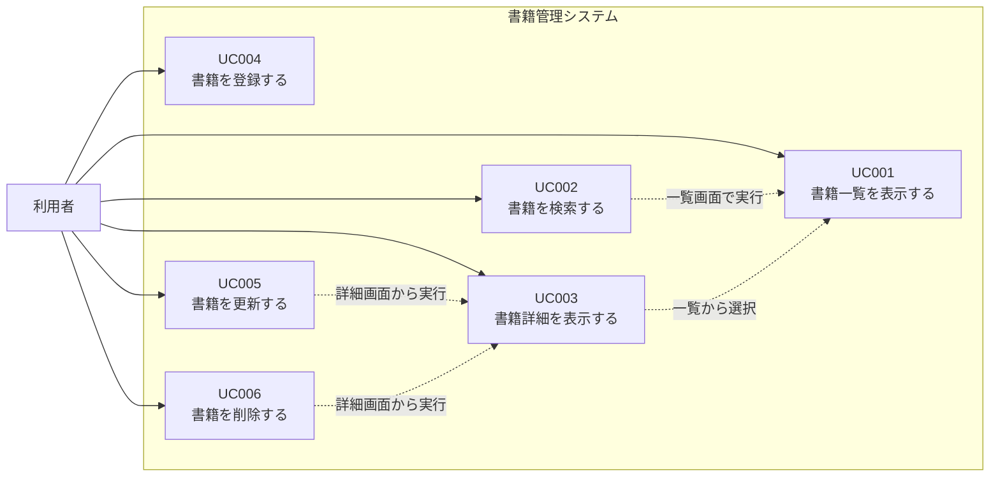

# SPA入門 総合演習ガイド

## 書籍管理システム

この総合演習では、SPA入門で学習した内容を使い、書籍情報を管理するSPAを作成します。

題材は「書籍管理システム」です。メインテキストでは `products` テーブルを使った商品管理、演習ガイドでは `employee` テーブルを使った社員管理を扱いました。本演習では、それらの実装パターンを `books` テーブルへ置き換えて実装します。

## 1. 演習概要

### 1.1 目的

HTML、CSS、JavaScript、Axios、Express、SQLite、Modal、Navigation APIを組み合わせ、画面遷移を伴わない書籍管理SPAを実装できるようになることを目的とします。

### 1.2 作成する機能

| 機能ID | 機能名 | 概要 | 表現方法 |
|---|---|---|---|
| FUNC-001 | 書籍一覧表示 | 登録済み書籍を一覧表示する | 疑似画面 |
| FUNC-002 | 書籍検索 | 書籍名のキーワードで一覧を絞り込む | 一覧画面内 |
| FUNC-003 | 書籍詳細表示 | 選択した書籍の詳細情報を表示する | 疑似画面 |
| FUNC-004 | 書籍新規登録 | 新しい書籍情報を登録する | 疑似画面 |
| FUNC-005 | 書籍情報更新 | 登録済み書籍情報を変更する | Modal |
| FUNC-006 | 書籍削除 | 登録済み書籍情報を削除する | Modal |

### 1.3 使用技術

| 分類 | 使用技術 | 備考 |
|---|---|---|
| フロントエンド | HTML / CSS / JavaScript | 素のJavaScriptで実装 |
| 非同期通信 | Axios | CDNから読み込み |
| SPA制御 | Navigation API | URLと画面表示を対応させる |
| UI部品 | Modal / ボタン / Offcanvas | テキストで扱った範囲だけ使用 |
| バックエンド | Node.js / Express | REST APIを作成 |
| データベース | SQLite | `books.db` を使用 |

## 2. 演習の進め方

### 2.1 開発手順

1. スターターキットの構成を確認する。
2. `books` テーブルと初期データを確認する。
3. Expressで書籍管理APIを作成する。
4. 書籍一覧画面を作成する。
5. 書籍検索を追加する。
6. 書籍詳細画面を作成する。
7. 書籍登録画面を作成する。
8. 書籍更新Modalを作成する。
9. 書籍削除Modalを作成する。
10. Navigation APIでURLと画面を対応させる。
11. JavaScriptファイルをコンポーネント単位で整理する。
12. 動作確認を行う。

### 2.2 提供物

| 提供物 | 内容 |
|---|---|
| `BookProject/index.html` | ヘッダー、フッター、サイドバー、モバイルメニュー、`<main id="app">` を実装済み |
| `BookProject/css/style.css` | 画面レイアウトと書籍管理用classを定義済み |
| `BookProject/js/app.js` | `showHome()` のみ接続済み |
| `BookProject/js/components/home.js` | ホーム画面のみ実装済み |
| `BookProject/images/` | 書籍画像ファイル |
| `BookProject/db/books.sql` | `books` テーブル作成SQLと初期データ |
| `BookProject/api/` | Express API作成用フォルダ |
| `BookProject/api/node_modules/` | 依存パッケージをインストール済み |

### 2.3 作成する主なファイル

| ファイル | 役割 |
|---|---|
| `api/server.js` | Express APIとHTML配信を実装 |
| `js/components/book-list.js` | 書籍一覧・検索画面 |
| `js/components/book-detail.js` | 書籍詳細画面 |
| `js/components/book-register.js` | 書籍登録画面 |
| `js/components/book-update-modal.js` | 書籍更新Modal |
| `js/components/book-delete-modal.js` | 書籍削除Modal |

## 3. 画面一覧とUI方針

| URL | 表示内容 | 表示関数 | 備考 |
|---|---|---|---|
| `/` | ホーム | `showHome()` | スターターで実装済み |
| `/books` | 書籍一覧・検索 | `showBookList()` | 疑似画面 |
| `/books/new` | 書籍登録 | `showBookRegister()` | 疑似画面 |
| `/books/{id}` | 書籍詳細 | `showBookDetail(id)` | 疑似画面 |
| なし | 書籍更新 | `openUpdateModal(book)` | 詳細画面からModal表示 |
| なし | 書籍削除 | `openDeleteModal(book)` | 詳細画面からModal表示 |

## 4. データベース仕様

### 4.1 テーブル定義

テーブル名: `books`

| カラム名 | 論理名 | データ型 | 制約 | 説明 |
|---|---|---|---|---|
| `id` | 書籍ID | INTEGER | PRIMARY KEY AUTOINCREMENT | 書籍を識別する番号 |
| `title` | 書籍名 | TEXT | NOT NULL | 書籍のタイトル |
| `author` | 著者名 | TEXT | NOT NULL | 著者名 |
| `price` | 価格 | INTEGER | NOT NULL | 書籍価格 |
| `publisher` | 出版社 | TEXT | なし | 出版社名 |
| `image_path` | 画像パス | TEXT | なし | 表紙画像のパス |

### 4.2 必須項目

登録・更新時は、次の項目を必須とします。

| 項目 | 理由 |
|---|---|
| `title` | 一覧・詳細で主要情報として表示するため |
| `author` | 書籍情報として基本項目のため |
| `price` | 数値入力とAPI送信の練習に使用するため |

## 5. API仕様

| メソッド | URL | 概要 | 使用するSQL |
|---|---|---|---|
| GET | `/api/v1/books` | 書籍一覧取得 | `SELECT * FROM books` |
| GET | `/api/v1/books?keyword=xxx` | 書籍名検索 | `SELECT * FROM books WHERE title LIKE ?` |
| GET | `/api/v1/books/:id` | 書籍詳細取得 | `SELECT * FROM books WHERE id = ?` |
| POST | `/api/v1/books` | 書籍登録 | `INSERT INTO books ...` |
| PUT | `/api/v1/books/:id` | 書籍更新 | `UPDATE books SET ... WHERE id = ?` |
| DELETE | `/api/v1/books/:id` | 書籍削除 | `DELETE FROM books WHERE id = ?` |

## 6. 実装順序

### 6.1 API

1. Express、JSON受信、静的ファイル配信、SQLite接続を設定する。
2. `GET /api/v1/books` を実装する。
3. `keyword` クエリパラメータによる検索を追加する。
4. `GET /api/v1/books/:id` を実装する。
5. `POST /api/v1/books` を実装する。
6. `PUT /api/v1/books/:id` を実装する。
7. `DELETE /api/v1/books/:id` を実装する。
8. `/books`、`/books/new`、`/books/:id` に直接アクセスした場合も `index.html` を返す。

### 6.2 フロントエンド

1. `app.js` に各コンポーネントのimportを追加する。
2. `showPage(path)` でURLと表示関数を対応させる。
3. `book-list.js` で一覧表示と検索を実装する。
4. `book-detail.js` で詳細表示、更新ボタン、削除ボタンを実装する。
5. `book-register.js` で登録フォームとPOST処理を実装する。
6. `book-update-modal.js` で更新ModalとPUT処理を実装する。
7. `book-delete-modal.js` で削除確認ModalとDELETE処理を実装する。

## 7. 動作確認

| 確認項目 | 期待結果 |
|---|---|
| `/` を開く | ホーム画面が表示される |
| `/books` を開く | 書籍一覧が表示される |
| 検索欄にキーワードを入力する | 書籍名に一致する一覧が表示される |
| 一覧から詳細リンクをクリックする | URLが `/books/{id}` になり、詳細画面が表示される |
| `/books/new` を開く | 登録画面が表示される |
| 必須項目を入力して登録する | 書籍が登録され、一覧へ移動する |
| 詳細画面で更新ボタンを押す | 更新Modalが表示される |
| 更新Modalで更新する | Modalが閉じ、詳細画面が再読み込みされる |
| 詳細画面で削除ボタンを押す | 削除確認Modalが表示される |
| 削除を確定する | Modalが閉じ、一覧へ移動する |
| モバイル幅で三本線ボタンを押す | モバイルメニューが表示される |

## 8. 追加課題

時間に余裕がある場合は、次の課題に取り組みます。

| 課題 | 内容 |
|---|---|
| 並び替え | 価格の昇順・降順で一覧を並び替える |
| 画像プレビュー | 登録画面で画像パス入力後にプレビューを表示する |
| 入力チェック強化 | 価格が0以下の場合にエラーを表示する |
| メッセージ改善 | 登録・更新・削除後のメッセージを画面内に表示する |

## 9. ユースケース

### 9.1 ユースケース概要

書籍管理システムでは、書籍情報を一覧表示し、必要に応じて検索、詳細確認、登録、更新、削除を行います。

本システムは学習用のSPAであるため、利用者のログイン機能や権限管理は扱いません。すべての操作は、同じ利用者が行うものとします。

### 9.2 アクター

| アクター | 説明 |
|---|---|
| 利用者 | 書籍情報を管理する人。書籍の一覧確認、検索、詳細確認、登録、更新、削除を行う。 |

### 9.3 ユースケース一覧

| ユースケースID | ユースケース名 | 概要 | 対応機能 |
|---|---|---|---|
| UC001 | 書籍一覧を表示する | 登録済みの書籍を一覧で確認する。 | FUNC-001 |
| UC002 | 書籍を検索する | 書籍名のキーワードで一覧を絞り込む。 | FUNC-002 |
| UC003 | 書籍詳細を表示する | 一覧で選択した書籍の詳細情報を確認する。 | FUNC-003 |
| UC004 | 書籍を登録する | 新しい書籍情報を登録する。 | FUNC-004 |
| UC005 | 書籍を更新する | 登録済みの書籍情報を変更する。 | FUNC-005 |
| UC006 | 書籍を削除する | 登録済みの書籍情報を削除する。 | FUNC-006 |

### 9.4 ユースケース図

## 10. ユースケース仕様書

### UC001 書籍一覧を表示する

| 項目 | 内容 |
|---|---|
| ユースケースID | UC001 |
| ユースケース名 | 書籍一覧を表示する |
| アクター | 利用者 |
| 目的 | 登録済みの書籍を一覧で確認できるようにする。 |
| トリガー | 利用者がサイドバーまたはモバイルメニューの「書籍一覧」をクリックする。または、ブラウザで `/books` にアクセスする。 |
| 事前条件 | APIサーバーが起動している。`books` テーブルが存在している。 |
| 事後条件 | 書籍一覧画面が表示される。登録済みの書籍が0件の場合は、0件であることが分かる表示になる。 |
| 対応画面 | 書籍一覧画面 |
| 対応URL | `/books` |
| 対応API | `GET /api/v1/books` |
| 対応ファイル | `js/components/book-list.js`, `api/server.js` |

#### 基本フロー

1. 利用者が「書籍一覧」を選択する。
2. `app.js` がURL `/books` を判定し、`showBookList()` を呼び出す。
3. `showBookList()` が `GET /api/v1/books` をAxiosで呼び出す。
4. APIが `books` テーブルから書籍情報を取得する。
5. APIが書籍情報の配列をJSONで返す。
6. 画面側で取得した配列を1件ずつHTML文字列に変換する。
7. 書籍一覧を画面に表示する。

#### 代替フロー・例外フロー

| 条件 | 処理 |
|---|---|
| 書籍が0件の場合 | 一覧テーブルを空にするだけではなく、「登録されている書籍はありません。」などのメッセージを表示する。 |
| API通信に失敗した場合 | コンソールにエラーを出力し、画面には「書籍一覧を取得できませんでした。」と表示する。 |

#### 表示項目

| 項目 | 表示内容 |
|---|---|
| 画像 | `image_path` を使い、書籍の表紙画像を表示する。 |
| 書籍ID | `id` を表示する。 |
| 書籍名 | `title` を表示する。詳細画面へ移動するリンクにする。 |
| 著者名 | `author` を表示する。 |
| 価格 | `price` を表示する。 |
| 出版社 | `publisher` を表示する。 |

#### 動作確認

| 確認内容 | 期待結果 |
|---|---|
| `/books` にアクセスする | 書籍一覧画面が表示される。 |
| 初期データがある状態で表示する | 複数の書籍が一覧に表示される。 |
| 書籍名リンクをクリックする | ページ全体を再読み込みせず、詳細画面へ移動する。 |

### UC002 書籍を検索する

| 項目 | 内容 |
|---|---|
| ユースケースID | UC002 |
| ユースケース名 | 書籍を検索する |
| アクター | 利用者 |
| 目的 | 書籍名の一部を使って、目的の書籍を探しやすくする。 |
| トリガー | 利用者が検索欄にキーワードを入力し、「検索」ボタンをクリックする。 |
| 事前条件 | 書籍一覧画面が表示されている。 |
| 事後条件 | 入力したキーワードに一致する書籍だけが一覧に表示される。 |
| 対応画面 | 書籍一覧画面 |
| 対応URL | `/books` |
| 対応API | `GET /api/v1/books?keyword=キーワード` |
| 対応ファイル | `js/components/book-list.js`, `api/server.js` |

#### 基本フロー

1. 利用者が検索欄にキーワードを入力する。
2. 利用者が「検索」ボタンをクリックする。
3. 画面側で検索欄の値を取得する。
4. `GET /api/v1/books?keyword=キーワード` をAxiosで呼び出す。
5. APIが `title LIKE ?` を使って書籍名を部分一致検索する。
6. APIが検索結果の配列をJSONで返す。
7. 画面側で一覧の表示内容を検索結果に置き換える。

#### 代替フロー・例外フロー

| 条件 | 処理 |
|---|---|
| キーワードが空欄の場合 | 全件検索として扱い、すべての書籍を表示する。 |
| 検索結果が0件の場合 | 「条件に一致する書籍はありません。」と表示する。 |
| API通信に失敗した場合 | コンソールにエラーを出力し、画面には「検索に失敗しました。」と表示する。 |

#### 入力項目

| 項目 | 内容 |
|---|---|
| キーワード | 書籍名に含まれる文字列。空欄も許可する。 |

#### 動作確認

| 確認内容 | 期待結果 |
|---|---|
| 存在する書籍名の一部で検索する | 一致する書籍だけが表示される。 |
| 存在しないキーワードで検索する | 0件メッセージが表示される。 |
| 空欄で検索する | 全件が表示される。 |

### UC003 書籍詳細を表示する

| 項目 | 内容 |
|---|---|
| ユースケースID | UC003 |
| ユースケース名 | 書籍詳細を表示する |
| アクター | 利用者 |
| 目的 | 選択した書籍の詳細情報を確認できるようにする。 |
| トリガー | 利用者が書籍一覧画面で書籍名リンクをクリックする。または、ブラウザで `/books/{id}` にアクセスする。 |
| 事前条件 | 対象の書籍が `books` テーブルに存在している。 |
| 事後条件 | 書籍詳細画面が表示される。 |
| 対応画面 | 書籍詳細画面 |
| 対応URL | `/books/{id}` |
| 対応API | `GET /api/v1/books/:id` |
| 対応ファイル | `js/components/book-detail.js`, `api/server.js` |

#### 基本フロー

1. 利用者が一覧画面の書籍名リンクをクリックする。
2. Navigation APIにより、URLが `/books/{id}` に変わる。
3. `app.js` がURLから書籍IDを取り出し、`showBookDetail(id)` を呼び出す。
4. `showBookDetail(id)` が `GET /api/v1/books/:id` をAxiosで呼び出す。
5. APIが `books` テーブルから該当する書籍を1件取得する。
6. APIが書籍オブジェクトをJSONで返す。
7. 画面側で書籍詳細を表示する。
8. 詳細画面に「更新」「削除」「一覧へ戻る」ボタンを表示する。

#### 代替フロー・例外フロー

| 条件 | 処理 |
|---|---|
| 対象IDの書籍が存在しない場合 | APIは404を返す。画面には「書籍情報を取得できませんでした。」と表示する。 |
| API通信に失敗した場合 | コンソールにエラーを出力し、一覧へ戻るボタンを表示する。 |

#### 表示項目

| 項目 | 表示内容 |
|---|---|
| 画像 | `image_path` を使い、表紙画像を表示する。 |
| 書籍ID | `id` を表示する。 |
| 書籍名 | `title` を表示する。 |
| 著者名 | `author` を表示する。 |
| 価格 | `price` を表示する。 |
| 出版社 | `publisher` を表示する。 |
| 画像パス | `image_path` を表示する。 |

#### 動作確認

| 確認内容 | 期待結果 |
|---|---|
| 一覧から書籍名をクリックする | 詳細画面が表示される。 |
| `/books/1` に直接アクセスする | IDが1の書籍詳細が表示される。 |
| 詳細画面の「一覧へ戻る」をクリックする | 書籍一覧画面へ戻る。 |

### UC004 書籍を登録する

| 項目 | 内容 |
|---|---|
| ユースケースID | UC004 |
| ユースケース名 | 書籍を登録する |
| アクター | 利用者 |
| 目的 | 新しい書籍情報をシステムに追加する。 |
| トリガー | 利用者がサイドバーまたはモバイルメニューの「書籍登録」をクリックする。または、ブラウザで `/books/new` にアクセスする。 |
| 事前条件 | APIサーバーが起動している。 |
| 事後条件 | 入力した書籍情報が `books` テーブルに登録される。登録後、書籍一覧画面へ移動する。 |
| 対応画面 | 書籍登録画面 |
| 対応URL | `/books/new` |
| 対応API | `POST /api/v1/books` |
| 対応ファイル | `js/components/book-register.js`, `api/server.js` |

#### 基本フロー

1. 利用者が「書籍登録」を選択する。
2. `app.js` がURL `/books/new` を判定し、`showBookRegister()` を呼び出す。
3. 画面に書籍登録フォームを表示する。
4. 利用者が書籍名、著者名、価格、出版社、画像パスを入力する。
5. 利用者が「登録」ボタンをクリックする。
6. 画面側で入力値を取得する。
7. 必須項目である書籍名、著者名、価格が入力されているか確認する。
8. `POST /api/v1/books` をAxiosで呼び出す。
9. APIが `books` テーブルへ書籍情報を登録する。
10. APIが登録した書籍IDをJSONで返す。
11. 画面側で登録完了を通知する。
12. 書籍一覧画面へ移動する。

#### 代替フロー・例外フロー

| 条件 | 処理 |
|---|---|
| 書籍名、著者名、価格のいずれかが未入力の場合 | APIを呼び出さず、画面に「データを入力してください。」と表示する。 |
| API側で必須項目不足を検出した場合 | APIは400を返す。画面側はエラーを表示する。 |
| API通信に失敗した場合 | コンソールにエラーを出力し、登録画面に留まる。 |

#### 入力項目

| 項目 | 必須 | 入力例 | 備考 |
|---|---|---|---|
| 書籍名 | ○ | JavaScript入門 | `title` として送信する。 |
| 著者名 | ○ | 山田太郎 | `author` として送信する。 |
| 価格 | ○ | 2800 | `price` として送信する。 |
| 出版社 | - | サンプル出版 | `publisher` として送信する。 |
| 画像パス | - | `/images/book01.svg` | `image_path` として送信する。 |

#### 動作確認

| 確認内容 | 期待結果 |
|---|---|
| 必須項目を入力して登録する | 書籍が登録され、一覧画面へ移動する。 |
| 必須項目を空欄にして登録する | エラーメッセージが表示され、登録されない。 |
| 登録後に一覧画面を確認する | 登録した書籍が表示される。 |

### UC005 書籍を更新する

| 項目 | 内容 |
|---|---|
| ユースケースID | UC005 |
| ユースケース名 | 書籍を更新する |
| アクター | 利用者 |
| 目的 | 登録済みの書籍情報を変更する。 |
| トリガー | 利用者が書籍詳細画面で「更新」ボタンをクリックする。 |
| 事前条件 | 書籍詳細画面が表示されている。対象の書籍が `books` テーブルに存在している。 |
| 事後条件 | 入力した内容で `books` テーブルの該当レコードが更新される。更新後、詳細画面に最新情報が表示される。 |
| 対応画面 | 書籍詳細画面、書籍更新Modal |
| 対応URL | `/books/{id}` |
| 対応API | `PUT /api/v1/books/:id` |
| 対応ファイル | `js/components/book-detail.js`, `js/components/book-update-modal.js`, `api/server.js` |

#### 基本フロー

1. 利用者が書籍詳細画面を表示する。
2. 利用者が「更新」ボタンをクリックする。
3. `book-detail.js` が `openUpdateModal(book)` を呼び出す。
4. 更新Modalに現在の書籍情報を初期値として表示する。
5. 利用者が入力内容を変更する。
6. 利用者がModal内の「更新」ボタンをクリックする。
7. 画面側で入力値を取得する。
8. 必須項目である書籍名、著者名、価格が入力されているか確認する。
9. `PUT /api/v1/books/:id` をAxiosで呼び出す。
10. APIが `books` テーブルの該当レコードを更新する。
11. APIが更新完了メッセージをJSONで返す。
12. 画面側で更新完了を通知する。
13. Modalを閉じる。
14. 現在の詳細画面を再読み込みし、更新後の情報を表示する。

#### 代替フロー・例外フロー

| 条件 | 処理 |
|---|---|
| 必須項目が未入力の場合 | APIを呼び出さず、Modal内に「データを入力してください。」と表示する。 |
| 対象IDの書籍が存在しない場合 | APIは404相当のエラーを返す。画面側はエラーを表示する。 |
| API通信に失敗した場合 | コンソールにエラーを出力し、Modalを開いたままにする。 |

#### 入力項目

| 項目 | 必須 | 初期値 | 備考 |
|---|---|---|---|
| 書籍名 | ○ | 現在の `title` | 変更可能。 |
| 著者名 | ○ | 現在の `author` | 変更可能。 |
| 価格 | ○ | 現在の `price` | 変更可能。 |
| 出版社 | - | 現在の `publisher` | 変更可能。 |
| 画像パス | - | 現在の `image_path` | 変更可能。 |

#### 動作確認

| 確認内容 | 期待結果 |
|---|---|
| 詳細画面で更新ボタンを押す | 更新Modalが表示され、現在値が入力済みになっている。 |
| 値を変更して更新する | Modalが閉じ、詳細画面に更新後の情報が表示される。 |
| 必須項目を空欄にして更新する | Modal内にエラーメッセージが表示され、更新されない。 |

### UC006 書籍を削除する

| 項目 | 内容 |
|---|---|
| ユースケースID | UC006 |
| ユースケース名 | 書籍を削除する |
| アクター | 利用者 |
| 目的 | 不要になった書籍情報を削除する。 |
| トリガー | 利用者が書籍詳細画面で「削除」ボタンをクリックする。 |
| 事前条件 | 書籍詳細画面が表示されている。対象の書籍が `books` テーブルに存在している。 |
| 事後条件 | 対象の書籍情報が `books` テーブルから削除される。削除後、書籍一覧画面へ移動する。 |
| 対応画面 | 書籍詳細画面、書籍削除Modal |
| 対応URL | `/books/{id}` |
| 対応API | `DELETE /api/v1/books/:id` |
| 対応ファイル | `js/components/book-detail.js`, `js/components/book-delete-modal.js`, `api/server.js` |

#### 基本フロー

1. 利用者が書籍詳細画面を表示する。
2. 利用者が「削除」ボタンをクリックする。
3. `book-detail.js` が `openDeleteModal(book)` を呼び出す。
4. 削除確認Modalに削除対象の書籍名を表示する。
5. 利用者がModal内の「削除」ボタンをクリックする。
6. `DELETE /api/v1/books/:id` をAxiosで呼び出す。
7. APIが `books` テーブルから該当レコードを削除する。
8. APIが削除完了メッセージをJSONで返す。
9. 画面側で削除完了を通知する。
10. Modalを閉じる。
11. 書籍一覧画面へ移動する。

#### 代替フロー・例外フロー

| 条件 | 処理 |
|---|---|
| 利用者が「キャンセル」または閉じるボタンをクリックした場合 | Modalを閉じる。削除APIは呼び出さない。 |
| 対象IDの書籍が存在しない場合 | APIはエラーを返す。画面側はエラーを表示する。 |
| API通信に失敗した場合 | コンソールにエラーを出力し、Modalを開いたままにする。 |

#### 表示項目

| 項目 | 表示内容 |
|---|---|
| 確認メッセージ | 「{書籍名} を削除してもよろしいですか？」 |
| 削除ボタン | 削除処理を実行する。 |
| キャンセルボタン | 削除せずModalを閉じる。 |

#### 動作確認

| 確認内容 | 期待結果 |
|---|---|
| 詳細画面で削除ボタンを押す | 削除確認Modalが表示される。 |
| キャンセルする | Modalが閉じ、書籍は削除されない。 |
| 削除を確定する | 書籍が削除され、一覧画面へ移動する。 |
| 削除後に一覧を確認する | 削除した書籍が表示されない。 |

### 10.1 ユースケースと実装ファイルの対応

| ユースケース | フロントエンド | バックエンド |
|---|---|---|
| UC001 書籍一覧を表示する | `book-list.js` | `GET /api/v1/books` |
| UC002 書籍を検索する | `book-list.js` | `GET /api/v1/books?keyword=xxx` |
| UC003 書籍詳細を表示する | `book-detail.js` | `GET /api/v1/books/:id` |
| UC004 書籍を登録する | `book-register.js` | `POST /api/v1/books` |
| UC005 書籍を更新する | `book-update-modal.js` | `PUT /api/v1/books/:id` |
| UC006 書籍を削除する | `book-delete-modal.js` | `DELETE /api/v1/books/:id` |
