# SPA入門 総合演習ガイド

## 書籍管理システム

この総合演習では、SPA入門で学習した内容を使い、書籍情報を管理するSPAを作成します。

題材は「書籍管理システム」です。メインテキストでは `products` テーブルを使った商品管理、演習ガイドでは `employee` テーブルを使った社員管理を扱いました。本演習では、それらの実装パターンを `books` テーブルへ置き換えて実装します。

## 1. 演習概要

### 1.1 目的

HTML、CSS、JavaScript、Axios、Express、SQLite、Modal、Navigation APIを組み合わせ、画面遷移を伴わない書籍管理SPAを実装できるようになることを目的とします。

### 1.2 作成する機能

| 機能ID | 機能名 | 概要 | 表現方法 |
|---|---|---|---|
| FUNC-000 | トップページ表示 | システム概要、主要操作ボタン、機能案内を表示する | 疑似画面 |
| FUNC-001 | 書籍一覧表示 | 登録済み書籍を一覧表示する | 疑似画面 |
| FUNC-002 | 書籍検索 | 書籍名のキーワードで一覧を絞り込む | 一覧画面内 |
| FUNC-003 | 書籍詳細表示 | 選択した書籍の詳細情報を表示する | 疑似画面 |
| FUNC-004 | 書籍新規登録 | 新しい書籍情報を登録する | 疑似画面 |
| FUNC-005 | 書籍情報更新 | 登録済み書籍情報を変更する | Modal |
| FUNC-006 | 書籍削除 | 登録済み書籍情報を削除する | Modal |

基本機能のトップページでは、システム概要、主要操作ボタン、機能案内を表示します。主要操作ボタンから「書籍一覧」と「書籍登録」へ移動でき、共通レイアウトのサイドバーまたはモバイルメニューからも各機能へ移動できます。画面全体では、Bootstrap Iconsを使ってヘッダー、メニュー、ボタン、機能案内を見分けやすくします。

追加機能の候補として、トップページに登録書籍数と最近登録された書籍を表示するダッシュボード機能を用意します。

| 追加機能ID | 追加機能名 | 概要 |
|---|---|---|
| ADD-001 | トップページ情報表示 | 登録書籍数と最近登録された書籍をトップページに表示する |
| ADD-002 | ログイン機能 | ユーザーIDとパスワードでログインできるようにする |
| ADD-003 | 権限管理 | `role` によって利用できる機能を制御する |

### 1.3 使用技術

| 分類 | 使用技術 | 備考 |
|---|---|---|
| フロントエンド | HTML / CSS / JavaScript | 素のJavaScriptで実装 |
| 非同期通信 | Axios | CDNから読み込み |
| SPA制御 | Navigation API | URLと画面表示を対応させる |
| UI部品 | Modal / ボタン / Offcanvas / Bootstrap Icons | テキストで扱った範囲を中心に使用 |
| バックエンド | Node.js / Express | REST APIを作成 |
| 通信許可 | CORS | フロントエンドからAPIへアクセスできるようにする |
| データベース | SQLite | `books.db` を使用 |

## 2. 演習の進め方

### 2.1 開発手順

1. スターターキットの構成を確認する。
2. トップページの役割を確認する。
3. `books` テーブルと初期データを確認する。
4. Expressで書籍管理APIを作成する。
5. Navigation APIでURLと画面を対応させる。
6. 書籍一覧画面を作成する。
7. 書籍検索を追加する。
8. 書籍詳細画面を作成する。
9. 書籍登録画面を作成する。
10. 書籍更新Modalを作成する。
11. 書籍削除Modalを作成する。
12. JavaScriptファイルをコンポーネント単位で整理する。
13. 動作確認を行う。

トップページはスターターキットに実装済みの `showHome()` を確認するところから始めます。`showHome()` には、システム概要、主要操作ボタン、機能案内が実装されています。基本機能では、トップページをAPI通信の対象にはしません。登録書籍数や最近登録された書籍の表示は、追加機能として後から実装します。

### 2.2 提供物

| 提供物 | 内容 |
|---|---|
| `BookProject/index.html` | ヘッダー、フッター、サイドバー、モバイルメニュー、Bootstrap Icons、`<main id="app">` を実装済み |
| `BookProject/css/style.css` | 画面レイアウト、トップページ、書籍管理用classを定義済み |
| `BookProject/js/app.js` | `showHome()` のみ接続済み |
| `BookProject/js/components/home.js` | トップページのみ実装済み |
| `BookProject/images/` | 書籍画像ファイル |
| `BookProject/db/books.sql` | `books` テーブル作成SQLと初期データ |
| `BookProject/api/` | Express API作成用フォルダ |
| `BookProject/api/node_modules/` | 依存パッケージをインストール済み |

### 2.3 作成する主なファイル

| ファイル | 役割 |
|---|---|
| `api/server.js` | Express APIを実装 |
| `js/components/book-list.js` | 書籍一覧・検索画面 |
| `js/components/book-detail.js` | 書籍詳細画面 |
| `js/components/book-register.js` | 書籍登録画面 |
| `js/components/book-update-modal.js` | 書籍更新Modal |
| `js/components/book-delete-modal.js` | 書籍削除Modal |

## 3. ユースケース

### 3.1 ユースケース概要

書籍管理システムでは、書籍情報を一覧表示し、必要に応じて検索、詳細確認、登録、更新、削除を行います。

本システムの基本機能では、ログイン機能や権限管理は実装対象外とします。ただし、追加機能の候補としてログイン機能と権限管理を想定しているため、後続の追加機能仕様で扱います。

### 3.2 アクター

| アクター | 説明 |
|---|---|
| 利用者 | 書籍情報を管理する人。書籍の一覧確認、検索、詳細確認、登録、更新、削除を行う。 |

### 3.3 ユースケース一覧

| ユースケースID | ユースケース名 | 概要 | 対応機能 |
|---|---|---|---|
| UC000 | トップページを表示する | システム概要、主要操作ボタン、機能案内を確認する。 | FUNC-000 |
| UC001 | 書籍一覧を表示する | 登録済みの書籍を一覧で確認する。 | FUNC-001 |
| UC002 | 書籍を検索する | 書籍名のキーワードで一覧を絞り込む。 | FUNC-002 |
| UC003 | 書籍詳細を表示する | 一覧で選択した書籍の詳細情報を確認する。 | FUNC-003 |
| UC004 | 書籍を登録する | 新しい書籍情報を登録する。 | FUNC-004 |
| UC005 | 書籍を更新する | 登録済みの書籍情報を変更する。 | FUNC-005 |
| UC006 | 書籍を削除する | 登録済みの書籍情報を削除する。 | FUNC-006 |

### 3.4 ユースケース図

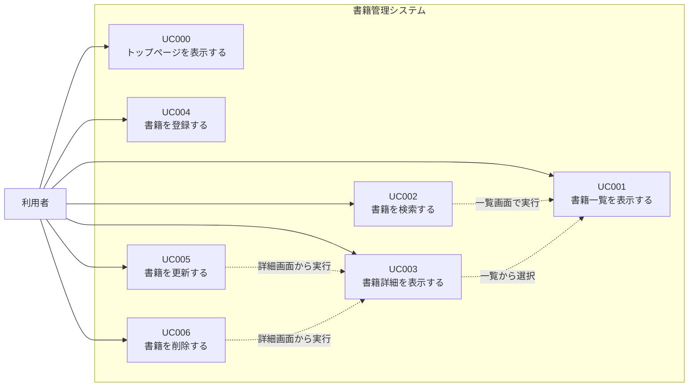
```mermaid
flowchart LR
    user["利用者"]

    subgraph system["書籍管理システム"]
        UC000["UC000\nトップページを表示する"]
        UC001["UC001\n書籍一覧を表示する"]
        UC002["UC002\n書籍を検索する"]
        UC003["UC003\n書籍詳細を表示する"]
        UC004["UC004\n書籍を登録する"]
        UC005["UC005\n書籍を更新する"]
        UC006["UC006\n書籍を削除する"]
    end

    user --> UC000
    user --> UC001
    user --> UC002
    user --> UC003
    user --> UC004
    user --> UC005
    user --> UC006

    UC002 -. "一覧画面で実行" .-> UC001
    UC003 -. "一覧から選択" .-> UC001
    UC005 -. "詳細画面から実行" .-> UC003
    UC006 -. "詳細画面から実行" .-> UC003
```

## 4. ユースケース仕様書

### UC000 トップページを表示する

| 項目 | 内容 |
|---|---|
| ユースケースID | UC000 |
| ユースケース名 | トップページを表示する |
| アクター | 利用者 |
| 目的 | システムの概要、主要操作、基本的な機能範囲を確認できるようにする。 |
| トリガー | 利用者がブラウザで `/` にアクセスする。または、サイドバーやモバイルメニューの「トップページ」をクリックする。 |
| 事前条件 | APIサーバーが起動している。 |
| 事後条件 | トップページが表示される。 |
| 対応画面 | トップページ |
| 対応URL | `/` |
| 対応API | なし |
| 対応ファイル | `js/components/home.js`, `js/app.js` |

#### 基本フロー

1. 利用者が `/` にアクセスする。
2. `app.js` がURL `/` を判定し、`showHome()` を呼び出す。
3. `showHome()` がトップページのHTMLを作成する。
4. `id="app"` の要素にトップページを表示する。
5. 利用者は画面の説明と機能案内を読み、トップページ内の主要操作ボタン、サイドバー、またはモバイルメニューから操作を選択する。

#### 代替フロー・例外フロー

| 条件 | 処理 |
|---|---|
| `/index.html` にアクセスした場合 | `/` と同じトップページを表示する。 |
| モバイル幅で表示した場合 | サイドバーの代わりに三本線ボタンからモバイルメニューを開く。 |

#### 表示項目

| 項目 | 表示内容 |
|---|---|
| システム名 | 書籍管理システムであることを表示する。 |
| システム概要 | 書籍情報の一覧、検索、詳細確認、登録、更新、削除を行うSPAであることを説明する。 |
| 主要操作ボタン | 「書籍一覧を見る」「書籍を登録する」を表示し、トップページから主要画面へ移動できるようにする。 |
| 機能案内 | 一覧・検索、詳細確認、登録・更新・削除の3つをカード風に表示する。 |
| アイコン | Bootstrap Iconsを使い、システム名、メニュー、ボタン、機能案内を視覚的に分かりやすくする。 |

#### 動作確認

| 確認内容 | 期待結果 |
|---|---|
| `/` にアクセスする | トップページが表示される。 |
| 「トップページ」をクリックする | トップページが表示される。 |
| 「書籍一覧を見る」をクリックする | 書籍一覧画面が表示される。 |
| 「書籍を登録する」をクリックする | 書籍登録画面が表示される。 |
| トップページからサイドバーを確認する | 書籍一覧、書籍登録へ移動できるメニューが表示されている。 |

#### 追加機能候補

| 追加機能 | 内容 |
|---|---|
| 登録書籍数表示 | `books` テーブルの件数を取得し、トップページに表示する。 |
| 最近登録された書籍表示 | 登録順の新しい書籍を数件取得し、トップページに表示する。 |

### UC001 書籍一覧を表示する

| 項目 | 内容 |
|---|---|
| ユースケースID | UC001 |
| ユースケース名 | 書籍一覧を表示する |
| アクター | 利用者 |
| 目的 | 登録済みの書籍を一覧で確認できるようにする。 |
| トリガー | 利用者がサイドバーまたはモバイルメニューの「書籍一覧」をクリックする。 |
| 事前条件 | APIサーバーが起動している。`books` テーブルが存在している。 |
| 事後条件 | 書籍一覧画面が表示される。登録済みの書籍が0件の場合は、0件であることが分かる表示になる。 |
| 対応画面 | 書籍一覧画面 |
| 対応URL | `/books` |
| 対応API | `GET /api/v1/books` |
| 対応ファイル | `js/components/book-list.js`, `api/server.js` |

#### 基本フロー

1. 利用者が「書籍一覧」を選択する。
2. `app.js` がURL `/books` を判定し、`showBookList()` を呼び出す。
3. `showBookList()` が `GET /api/v1/books` をAxiosで呼び出す。
4. APIが `books` テーブルから書籍情報を取得する。
5. APIが書籍情報の配列をJSONで返す。
6. 画面側で取得した配列を1件ずつHTML文字列に変換する。
7. 書籍一覧を画面に表示する。

#### 代替フロー・例外フロー

| 条件 | 処理 |
|---|---|
| 書籍が0件の場合 | 一覧テーブルを空にするだけではなく、「登録されている書籍はありません。」などのメッセージを表示する。 |
| API通信に失敗した場合 | コンソールにエラーを出力し、画面には「書籍一覧を取得できませんでした。」と表示する。 |

#### 表示項目

| 項目 | 表示内容 |
|---|---|
| 画像 | `image_path` を使い、書籍の表紙画像を表示する。 |
| 書籍ID | `id` を表示する。 |
| 書籍名 | `title` を表示する。詳細画面へ移動するリンクにする。 |
| 著者名 | `author` を表示する。 |
| 価格 | `price` を表示する。 |
| 出版社 | `publisher` を表示する。 |

#### 動作確認

| 確認内容 | 期待結果 |
|---|---|
| トップページから「書籍一覧」をクリックする | 書籍一覧画面が表示される。 |
| 初期データがある状態で表示する | 複数の書籍が一覧に表示される。 |
| 書籍名リンクをクリックする | ページ全体を再読み込みせず、詳細画面へ移動する。 |

### UC002 書籍を検索する

| 項目 | 内容 |
|---|---|
| ユースケースID | UC002 |
| ユースケース名 | 書籍を検索する |
| アクター | 利用者 |
| 目的 | 書籍名の一部を使って、目的の書籍を探しやすくする。 |
| トリガー | 利用者が検索欄にキーワードを入力し、「検索」ボタンをクリックする。 |
| 事前条件 | 書籍一覧画面が表示されている。 |
| 事後条件 | 入力したキーワードに一致する書籍だけが一覧に表示される。 |
| 対応画面 | 書籍一覧画面 |
| 対応URL | `/books` |
| 対応API | `GET /api/v1/books?keyword=キーワード` |
| 対応ファイル | `js/components/book-list.js`, `api/server.js` |

#### 基本フロー

1. 利用者が検索欄にキーワードを入力する。
2. 利用者が「検索」ボタンをクリックする。
3. 画面側で検索欄の値を取得する。
4. `GET /api/v1/books?keyword=キーワード` をAxiosで呼び出す。
5. APIが `title LIKE ?` を使って書籍名を部分一致検索する。
6. APIが検索結果の配列をJSONで返す。
7. 画面側で一覧の表示内容を検索結果に置き換える。

#### 代替フロー・例外フロー

| 条件 | 処理 |
|---|---|
| キーワードが空欄の場合 | 全件検索として扱い、すべての書籍を表示する。 |
| 検索結果が0件の場合 | 「条件に一致する書籍はありません。」と表示する。 |
| API通信に失敗した場合 | コンソールにエラーを出力し、画面には「検索に失敗しました。」と表示する。 |

#### 入力項目

| 項目 | 内容 |
|---|---|
| キーワード | 書籍名に含まれる文字列。空欄も許可する。 |

#### 動作確認

| 確認内容 | 期待結果 |
|---|---|
| 存在する書籍名の一部で検索する | 一致する書籍だけが表示される。 |
| 存在しないキーワードで検索する | 0件メッセージが表示される。 |
| 空欄で検索する | 全件が表示される。 |

### UC003 書籍詳細を表示する

| 項目 | 内容 |
|---|---|
| ユースケースID | UC003 |
| ユースケース名 | 書籍詳細を表示する |
| アクター | 利用者 |
| 目的 | 選択した書籍の詳細情報を確認できるようにする。 |
| トリガー | 利用者が書籍一覧画面で書籍名リンクをクリックする。 |
| 事前条件 | 対象の書籍が `books` テーブルに存在している。 |
| 事後条件 | 書籍詳細画面が表示される。 |
| 対応画面 | 書籍詳細画面 |
| 対応URL | `/books/{id}` |
| 対応API | `GET /api/v1/books/:id` |
| 対応ファイル | `js/components/book-detail.js`, `api/server.js` |

#### 基本フロー

1. 利用者が一覧画面の書籍名リンクをクリックする。
2. Navigation APIにより、URLが `/books/{id}` に変わる。
3. `app.js` がURLから書籍IDを取り出し、`showBookDetail(id)` を呼び出す。
4. `showBookDetail(id)` が `GET /api/v1/books/:id` をAxiosで呼び出す。
5. APIが `books` テーブルから該当する書籍を1件取得する。
6. APIが書籍オブジェクトをJSONで返す。
7. 画面側で書籍詳細を表示する。
8. 詳細画面に「更新」「削除」「一覧へ戻る」ボタンを表示する。

#### 代替フロー・例外フロー

| 条件 | 処理 |
|---|---|
| 対象IDの書籍が存在しない場合 | APIは404を返す。画面には「書籍情報を取得できませんでした。」と表示する。 |
| API通信に失敗した場合 | コンソールにエラーを出力し、一覧へ戻るボタンを表示する。 |

#### 表示項目

| 項目 | 表示内容 |
|---|---|
| 画像 | `image_path` を使い、表紙画像を表示する。 |
| 書籍ID | `id` を表示する。 |
| 書籍名 | `title` を表示する。 |
| 著者名 | `author` を表示する。 |
| 価格 | `price` を表示する。 |
| 出版社 | `publisher` を表示する。 |
| 画像パス | `image_path` を表示する。 |

#### 動作確認

| 確認内容 | 期待結果 |
|---|---|
| 一覧から書籍名をクリックする | 詳細画面が表示される。 |
| 詳細画面の「一覧へ戻る」をクリックする | 書籍一覧画面へ戻る。 |

### UC004 書籍を登録する

| 項目 | 内容 |
|---|---|
| ユースケースID | UC004 |
| ユースケース名 | 書籍を登録する |
| アクター | 利用者 |
| 目的 | 新しい書籍情報をシステムに追加する。 |
| トリガー | 利用者がサイドバーまたはモバイルメニューの「書籍登録」をクリックする。 |
| 事前条件 | APIサーバーが起動している。 |
| 事後条件 | 入力した書籍情報が `books` テーブルに登録される。登録後、書籍一覧画面へ移動する。 |
| 対応画面 | 書籍登録画面 |
| 対応URL | `/books/new` |
| 対応API | `POST /api/v1/books` |
| 対応ファイル | `js/components/book-register.js`, `api/server.js` |

#### 基本フロー

1. 利用者が「書籍登録」を選択する。
2. `app.js` がURL `/books/new` を判定し、`showBookRegister()` を呼び出す。
3. 画面に書籍登録フォームを表示する。
4. 利用者が書籍名、著者名、価格、出版社、画像パスを入力する。
5. 利用者が「登録」ボタンをクリックする。
6. 画面側で入力値を取得する。
7. 必須項目である書籍名、著者名、価格が入力されているか確認する。
8. `POST /api/v1/books` をAxiosで呼び出す。
9. APIが `books` テーブルへ書籍情報を登録する。
10. APIが登録した書籍IDをJSONで返す。
11. 画面側で登録完了を通知する。
12. 書籍一覧画面へ移動する。

#### 代替フロー・例外フロー

| 条件 | 処理 |
|---|---|
| 書籍名、著者名、価格のいずれかが未入力の場合 | APIを呼び出さず、画面に「データを入力してください。」と表示する。 |
| API側で必須項目不足を検出した場合 | APIは400を返す。画面側はエラーを表示する。 |
| API通信に失敗した場合 | コンソールにエラーを出力し、登録画面に留まる。 |

#### 入力項目

| 項目 | 必須 | 入力例 | 備考 |
|---|---|---|---|
| 書籍名 | ○ | JavaScript入門 | `title` として送信する。 |
| 著者名 | ○ | 山田太郎 | `author` として送信する。 |
| 価格 | ○ | 2800 | `price` として送信する。 |
| 出版社 | - | サンプル出版 | `publisher` として送信する。 |
| 画像パス | - | `/images/1.png` | `image_path` として送信する。入力欄の `placeholder` ではなく、入力欄の下に `※例：/images/1.png` と表示する。 |

#### 動作確認

| 確認内容 | 期待結果 |
|---|---|
| 必須項目を入力して登録する | 書籍が登録され、一覧画面へ移動する。 |
| 必須項目を空欄にして登録する | エラーメッセージが表示され、登録されない。 |
| 登録後に一覧画面を確認する | 登録した書籍が表示される。 |

### UC005 書籍を更新する

| 項目 | 内容 |
|---|---|
| ユースケースID | UC005 |
| ユースケース名 | 書籍を更新する |
| アクター | 利用者 |
| 目的 | 登録済みの書籍情報を変更する。 |
| トリガー | 利用者が書籍詳細画面で「更新」ボタンをクリックする。 |
| 事前条件 | 書籍詳細画面が表示されている。対象の書籍が `books` テーブルに存在している。 |
| 事後条件 | 入力した内容で `books` テーブルの該当レコードが更新される。更新後、詳細画面に最新情報が表示される。 |
| 対応画面 | 書籍詳細画面、書籍更新Modal |
| 対応URL | `/books/{id}` |
| 対応API | `PUT /api/v1/books/:id` |
| 対応ファイル | `js/components/book-detail.js`, `js/components/book-update-modal.js`, `api/server.js` |

#### 基本フロー

1. 利用者が書籍詳細画面を表示する。
2. 利用者が「更新」ボタンをクリックする。
3. `book-detail.js` が `openUpdateModal(book)` を呼び出す。
4. 更新Modalに現在の書籍情報を初期値として表示する。
5. 利用者が入力内容を変更する。
6. 利用者がModal内の「更新」ボタンをクリックする。
7. 画面側で入力値を取得する。
8. 必須項目である書籍名、著者名、価格が入力されているか確認する。
9. `PUT /api/v1/books/:id` をAxiosで呼び出す。
10. APIが `books` テーブルの該当レコードを更新する。
11. APIが更新完了メッセージをJSONで返す。
12. 画面側で更新完了を通知する。
13. Modalを閉じる。
14. 現在の詳細画面を再読み込みし、更新後の情報を表示する。

#### 代替フロー・例外フロー

| 条件 | 処理 |
|---|---|
| 必須項目が未入力の場合 | APIを呼び出さず、Modal内に「データを入力してください。」と表示する。 |
| 対象IDの書籍が存在しない場合 | APIは404相当のエラーを返す。画面側はエラーを表示する。 |
| API通信に失敗した場合 | コンソールにエラーを出力し、Modalを開いたままにする。 |

#### 入力項目

| 項目 | 必須 | 初期値 | 備考 |
|---|---|---|---|
| 書籍名 | ○ | 現在の `title` | 変更可能。 |
| 著者名 | ○ | 現在の `author` | 変更可能。 |
| 価格 | ○ | 現在の `price` | 変更可能。 |
| 出版社 | - | 現在の `publisher` | 変更可能。 |
| 画像パス | - | 現在の `image_path` | 変更可能。入力欄の下に `※例：/images/1.png` と表示する。 |

#### 動作確認

| 確認内容 | 期待結果 |
|---|---|
| 詳細画面で更新ボタンを押す | 更新Modalが表示され、現在値が入力済みになっている。 |
| 値を変更して更新する | Modalが閉じ、詳細画面に更新後の情報が表示される。 |
| 必須項目を空欄にして更新する | Modal内にエラーメッセージが表示され、更新されない。 |

### UC006 書籍を削除する

| 項目 | 内容 |
|---|---|
| ユースケースID | UC006 |
| ユースケース名 | 書籍を削除する |
| アクター | 利用者 |
| 目的 | 不要になった書籍情報を削除する。 |
| トリガー | 利用者が書籍詳細画面で「削除」ボタンをクリックする。 |
| 事前条件 | 書籍詳細画面が表示されている。対象の書籍が `books` テーブルに存在している。 |
| 事後条件 | 対象の書籍情報が `books` テーブルから削除される。削除後、書籍一覧画面へ移動する。 |
| 対応画面 | 書籍詳細画面、書籍削除Modal |
| 対応URL | `/books/{id}` |
| 対応API | `DELETE /api/v1/books/:id` |
| 対応ファイル | `js/components/book-detail.js`, `js/components/book-delete-modal.js`, `api/server.js` |

#### 基本フロー

1. 利用者が書籍詳細画面を表示する。
2. 利用者が「削除」ボタンをクリックする。
3. `book-detail.js` が `openDeleteModal(book)` を呼び出す。
4. 削除確認Modalに削除対象の書籍名を表示する。
5. 利用者がModal内の「削除」ボタンをクリックする。
6. `DELETE /api/v1/books/:id` をAxiosで呼び出す。
7. APIが `books` テーブルから該当レコードを削除する。
8. APIが削除完了メッセージをJSONで返す。
9. 画面側で削除完了を通知する。
10. Modalを閉じる。
11. 書籍一覧画面へ移動する。

#### 代替フロー・例外フロー

| 条件 | 処理 |
|---|---|
| 利用者が「キャンセル」または閉じるボタンをクリックした場合 | Modalを閉じる。削除APIは呼び出さない。 |
| 対象IDの書籍が存在しない場合 | APIはエラーを返す。画面側はエラーを表示する。 |
| API通信に失敗した場合 | コンソールにエラーを出力し、Modalを開いたままにする。 |

#### 表示項目

| 項目 | 表示内容 |
|---|---|
| 確認メッセージ | 「{書籍名} を削除してもよろしいですか？」 |
| 削除ボタン | 削除処理を実行する。 |
| キャンセルボタン | 削除せずModalを閉じる。 |

#### 動作確認

| 確認内容 | 期待結果 |
|---|---|
| 詳細画面で削除ボタンを押す | 削除確認Modalが表示される。 |
| キャンセルする | Modalが閉じ、書籍は削除されない。 |
| 削除を確定する | 書籍が削除され、一覧画面へ移動する。 |
| 削除後に一覧を確認する | 削除した書籍が表示されない。 |

### 4.1 ユースケースと実装ファイルの対応

| ユースケース | フロントエンド | バックエンド |
|---|---|---|
| UC000 トップページを表示する | `home.js` | なし |
| UC001 書籍一覧を表示する | `book-list.js` | `GET /api/v1/books` |
| UC002 書籍を検索する | `book-list.js` | `GET /api/v1/books?keyword=xxx` |
| UC003 書籍詳細を表示する | `book-detail.js` | `GET /api/v1/books/:id` |
| UC004 書籍を登録する | `book-register.js` | `POST /api/v1/books` |
| UC005 書籍を更新する | `book-update-modal.js` | `PUT /api/v1/books/:id` |
| UC006 書籍を削除する | `book-delete-modal.js` | `DELETE /api/v1/books/:id` |

## 5. 画面一覧およびUIフロー図

### 5.1 画面一覧

本システムは、`index.html` の共通レイアウトを残したまま、`<main id="app">` の中身だけを切り替えるSPAとして作成します。

| 画面ID | 画面名 | URL | 表示関数 | 表示方式 | 主な役割 | 遷移・表示方法 |
|---|---|---|---|---|---|---|
| SCR-001 | トップページ | `/` | `showHome()` | 疑似画面 | システム概要、主要操作ボタン、機能案内を表示する。 | ブラウザで `/` を開く。またはメニューの「トップページ」をクリックする。 |
| SCR-002 | 書籍一覧画面 | `/books` | `showBookList()` | 疑似画面 | 書籍一覧表示と書籍名検索を行う。 | メニューの「書籍一覧」をクリックする。 |
| SCR-003 | 書籍登録画面 | `/books/new` | `showBookRegister()` | 疑似画面 | 新しい書籍情報を登録する。 | メニューの「書籍登録」をクリックする。 |
| SCR-004 | 書籍詳細画面 | `/books/{id}` | `showBookDetail(id)` | 疑似画面 | 選択した書籍の詳細情報を表示する。 | 書籍一覧画面の書籍名リンクをクリックする。 |
| SCR-005 | 書籍更新Modal | なし | `openUpdateModal(book)` | Modal | 登録済み書籍の情報を変更する。 | 書籍詳細画面の「更新」ボタンをクリックする。 |
| SCR-006 | 書籍削除Modal | なし | `openDeleteModal(book)` | Modal | 登録済み書籍を削除する前に確認する。 | 書籍詳細画面の「削除」ボタンをクリックする。 |
| SCR-007 | モバイルメニュー | なし | Bootstrap Offcanvas | Offcanvas | モバイル幅でメニューを表示する。 | ヘッダーの三本線ボタンをクリックする。 |

書籍詳細画面のURLは `/books/{id}` の形式ですが、利用者の通常操作では、書籍一覧画面のリンクから移動します。ブラウザのアドレス欄へ直接入力して利用することは、基本操作として扱いません。

### 5.2 共通レイアウト

| 領域 | HTML要素・ID/class | 内容 | 備考 |
|---|---|---|---|
| ヘッダー | `header.site-header` | システム名、Bootstrap Icons、モバイル用三本線ボタン | 全画面で共通 |
| サイドバー | `aside.sidebar` | トップページ、書籍一覧、書籍登録へのアイコン付きメニュー | PC幅で表示 |
| メイン領域 | `main#app.main-content` | 疑似画面を表示する領域 | JavaScriptで中身を差し替える |
| Modal挿入領域 | `div#modal-area` | 更新Modal、削除Modalを挿入する領域 | 画面移動時に空にする |
| モバイルメニュー | `div#mobileMenu` | モバイル幅用のアイコン付きメニュー | Offcanvasで表示 |
| フッター | `footer.site-footer` | システム名、Bootstrap Icons | 全画面で共通 |

### 5.3 全体UIフロー図

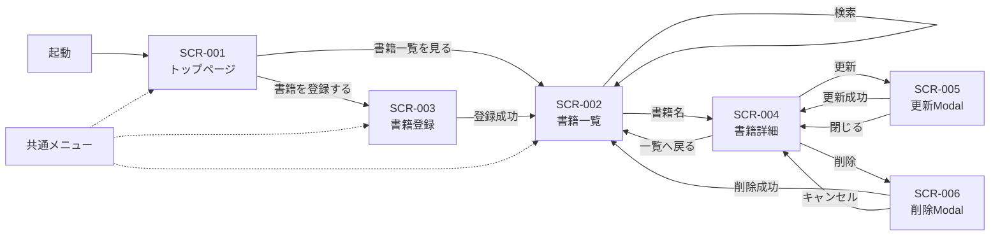
```mermaid
flowchart LR
    Start["起動"] --> Top["SCR-001<br>トップページ"]

    Top -->|書籍一覧を見る| List["SCR-002<br>書籍一覧"]
    Top -->|書籍を登録する| Register["SCR-003<br>書籍登録"]

    List -->|検索| List
    List -->|書籍名| Detail["SCR-004<br>書籍詳細"]
    Register -->|登録成功| List

    Detail -->|一覧へ戻る| List
    Detail -->|更新| UpdateModal["SCR-005<br>更新Modal"]
    Detail -->|削除| DeleteModal["SCR-006<br>削除Modal"]

    UpdateModal -->|更新成功| Detail
    UpdateModal -->|閉じる| Detail
    DeleteModal -->|削除成功| List
    DeleteModal -->|キャンセル| Detail

    Menu["共通メニュー"] -.-> Top
    Menu -.-> List
    Menu -.-> Register
```

共通メニューは、サイドバーまたはモバイルメニューを表します。図がPDF上で横幅に収まりやすいように、共通メニューから各画面への移動は点線でまとめています。

### 5.4 機能別UIフロー図

#### 5.4.1 トップページ表示

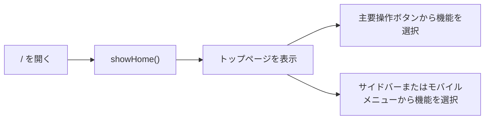
```mermaid
flowchart LR
    A["/ を開く"] --> B["showHome()"]
    B --> C["トップページを表示"]
    C --> D["主要操作ボタンから機能を選択"]
    C --> E["サイドバーまたはモバイルメニューから機能を選択"]
```

トップページでは、システム概要、主要操作ボタン、機能案内を表示します。主要操作ボタンにはBootstrap Iconsを付け、書籍一覧画面と書籍登録画面へ移動できるようにします。登録書籍数や最近登録された書籍の表示は、追加機能として扱います。

#### 5.4.2 書籍一覧・検索

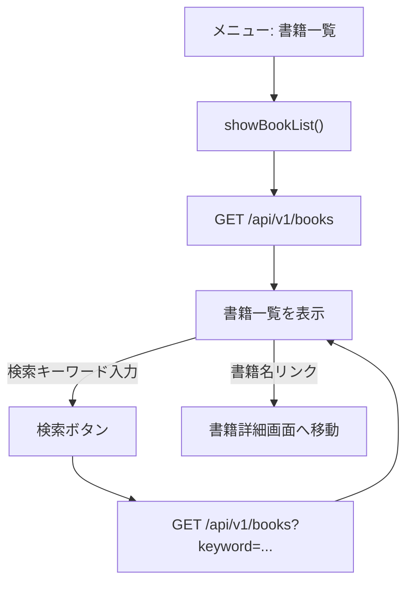
```mermaid
flowchart TD
    A["メニュー: 書籍一覧"] --> B["showBookList()"]
    B --> C["GET /api/v1/books"]
    C --> D["書籍一覧を表示"]
    D -->|検索キーワード入力| E["検索ボタン"]
    E --> F["GET /api/v1/books?keyword=..."]
    F --> D
    D -->|書籍名リンク| G["書籍詳細画面へ移動"]
```

検索は書籍一覧画面の中で行います。検索結果も同じ書籍一覧画面に表示します。

#### 5.4.3 書籍登録

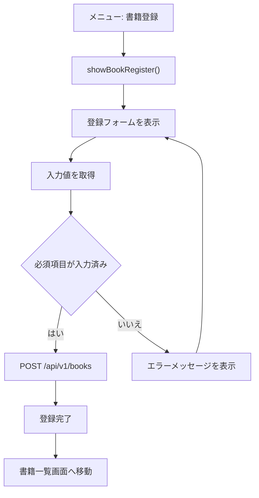
```mermaid
flowchart TD
    A["メニュー: 書籍登録"] --> B["showBookRegister()"]
    B --> C["登録フォームを表示"]
    C --> D["入力値を取得"]
    D --> E{"必須項目が入力済み"}
    E -->|はい| F["POST /api/v1/books"]
    F --> G["登録完了"]
    G --> H["書籍一覧画面へ移動"]
    E -->|いいえ| I["エラーメッセージを表示"]
    I --> C
```

登録画面は疑似画面として表示します。登録成功後は、書籍一覧画面へ移動します。

#### 5.4.4 書籍詳細

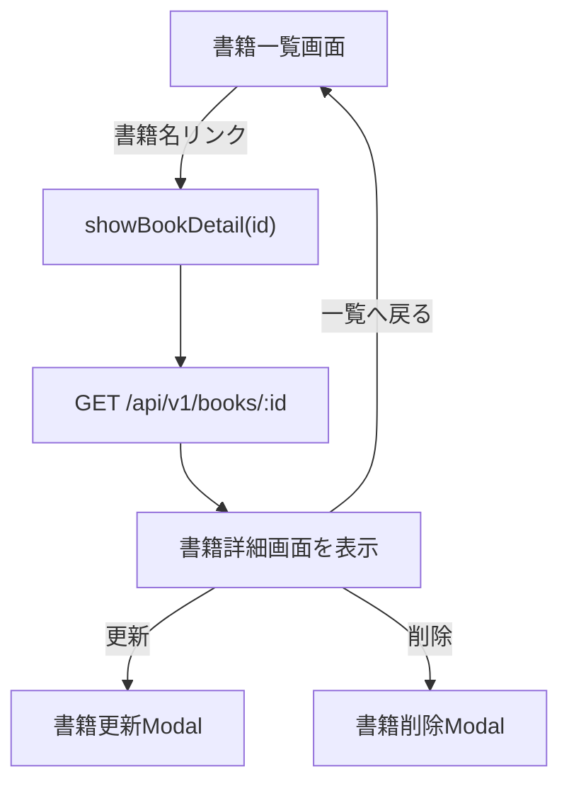
```mermaid
flowchart TD
    A["書籍一覧画面"] -->|書籍名リンク| B["showBookDetail(id)"]
    B --> C["GET /api/v1/books/:id"]
    C --> D["書籍詳細画面を表示"]
    D -->|一覧へ戻る| A
    D -->|更新| E["書籍更新Modal"]
    D -->|削除| F["書籍削除Modal"]
```

書籍詳細画面は、書籍一覧画面の書籍名リンクから表示します。ブラウザのアドレス欄へURLを直接入力する操作は、基本操作として扱いません。

#### 5.4.5 書籍更新Modal

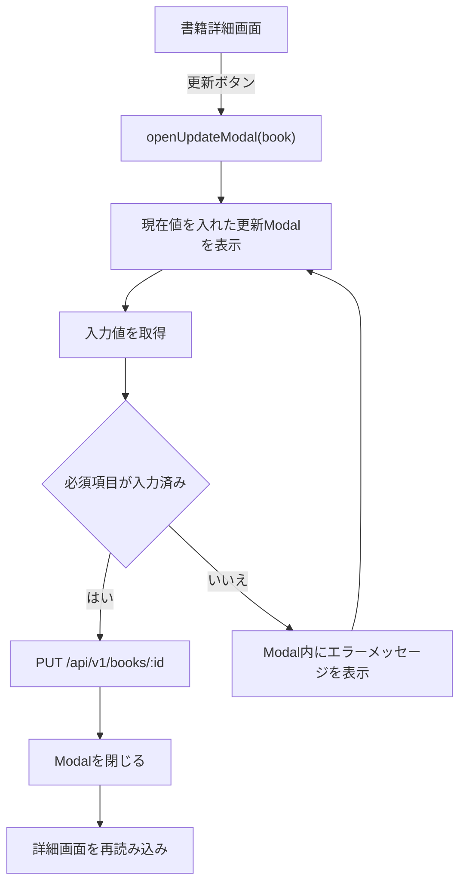
```mermaid
flowchart TD
    A["書籍詳細画面"] -->|更新ボタン| B["openUpdateModal(book)"]
    B --> C["現在値を入れた更新Modalを表示"]
    C --> D["入力値を取得"]
    D --> E{"必須項目が入力済み"}
    E -->|はい| F["PUT /api/v1/books/:id"]
    F --> G["Modalを閉じる"]
    G --> H["詳細画面を再読み込み"]
    E -->|いいえ| I["Modal内にエラーメッセージを表示"]
    I --> C
```

更新は詳細画面からModalで行います。更新成功後は、同じ詳細画面を再読み込みして最新情報を表示します。

#### 5.4.6 書籍削除Modal

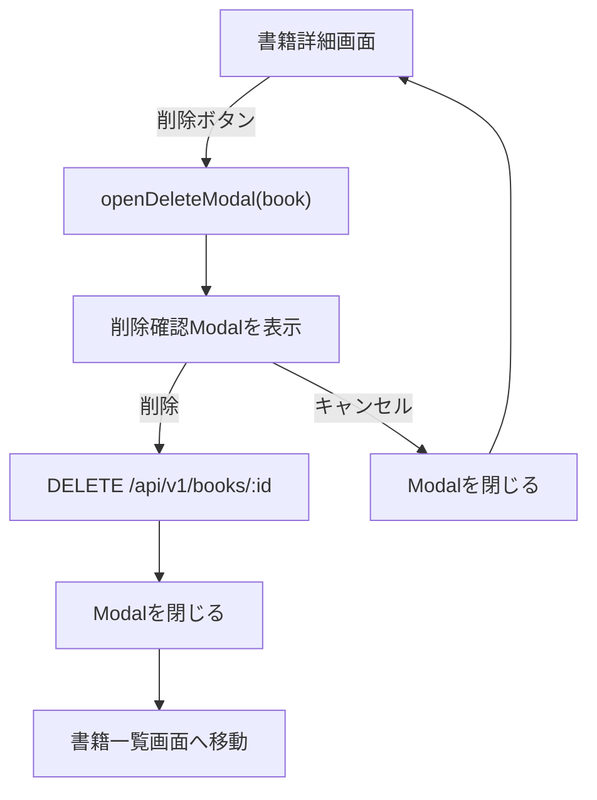
```mermaid
flowchart TD
    A["書籍詳細画面"] -->|削除ボタン| B["openDeleteModal(book)"]
    B --> C["削除確認Modalを表示"]
    C -->|削除| D["DELETE /api/v1/books/:id"]
    D --> E["Modalを閉じる"]
    E --> F["書籍一覧画面へ移動"]
    C -->|キャンセル| G["Modalを閉じる"]
    G --> A
```

削除は確認Modalを表示してから実行します。キャンセルした場合は削除せず、詳細画面に戻ります。

### 5.5 画面レイアウト図

> **⚠ 重要：以下の画面レイアウト図はあくまで完成イメージの参考図です。実装時は、必ずユースケース仕様書の記載内容を優先してください。** 画面の見た目やレイアウトが以下の図と100%同じになる必要はありません。ユースケース仕様書に記載された表示項目・入力項目・動作仕様を満たしていれば、デザインの細部は異なっていても構いません。

<div class="layout-diagram-block">

#### SCR-001 トップページ

システムの概要、主要操作ボタン（「書籍一覧を見る」「書籍を登録する」）、機能案内（一覧・検索、詳細確認、登録・更新・削除）が表示されます。

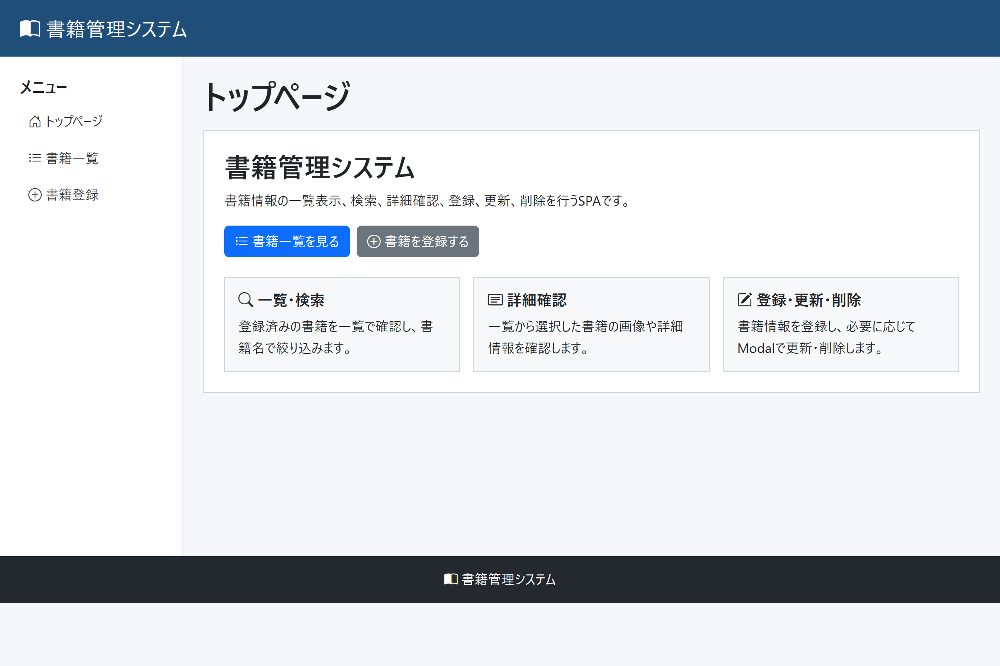

</div>

---

<div class="layout-diagram-block">

#### SCR-002 書籍一覧画面（全件表示）

サイドバーの「書籍一覧」をクリックした直後の画面です。登録済みの書籍が一覧で表示されます。検索欄と「検索」ボタンが上部にあります。

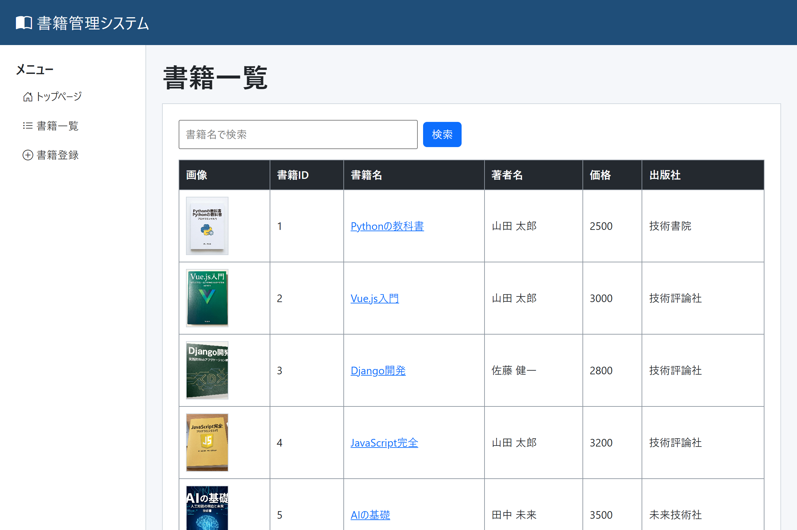

</div>

---

<div class="layout-diagram-block">

#### SCR-002 書籍一覧画面（検索結果0件）

存在しないキーワードで検索した場合の画面です。「条件に一致する書籍はありません。」というメッセージが表示されます。

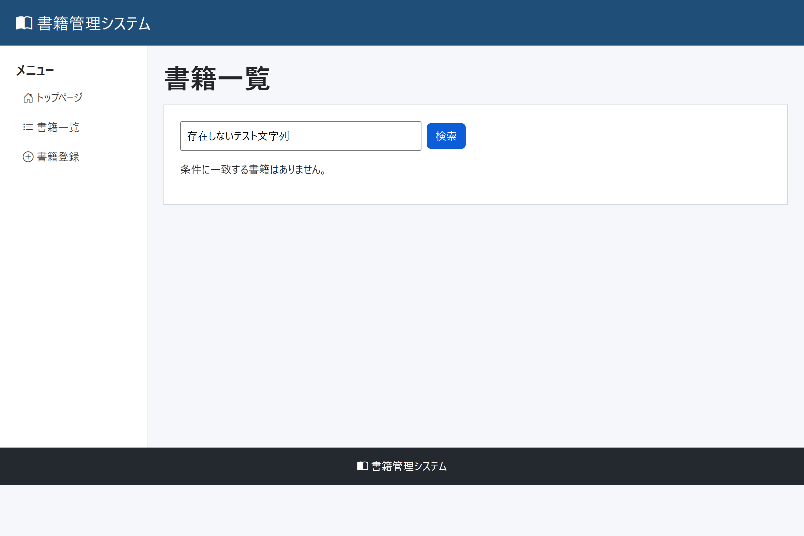

</div>

---

<div class="layout-diagram-block">

#### SCR-002 書籍一覧画面（検索成功）

キーワード「go」で検索した場合の画面です。書籍名に「go」を含む書籍（Django開発、Go言語）が絞り込まれて表示されます。

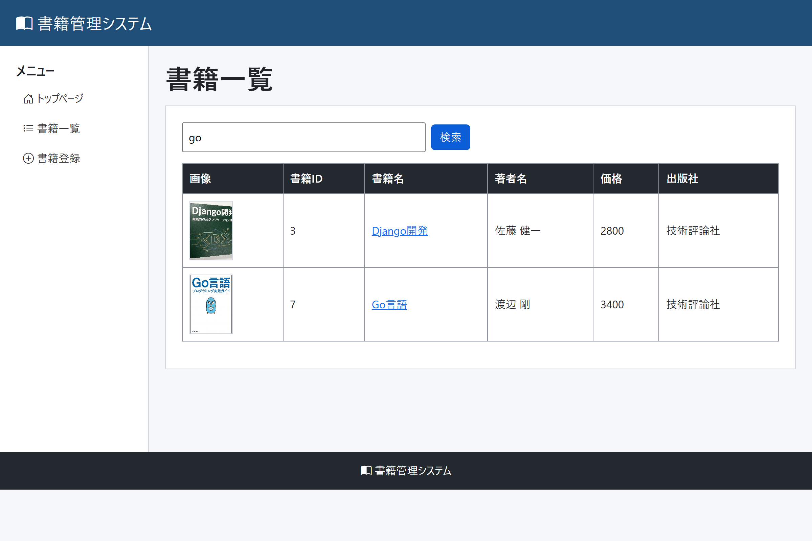

</div>

---

<div class="layout-diagram-block">

#### SCR-004 書籍詳細画面

書籍一覧画面の書籍名リンクをクリックして遷移した詳細画面です。書籍の画像、書籍ID、書籍名、著者名、価格、出版社、画像パスが表示されます。「更新」「削除」「一覧へ戻る」ボタンがあります。

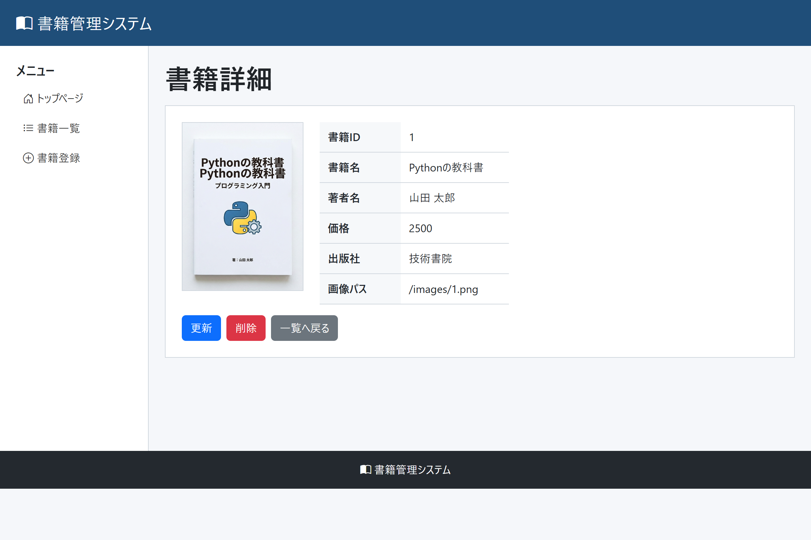

</div>

---

<div class="layout-diagram-block">

#### SCR-005 書籍更新Modal

書籍詳細画面の「更新」ボタンをクリックすると表示される更新Modalです。現在の書籍情報が初期値として入力済みになっています。

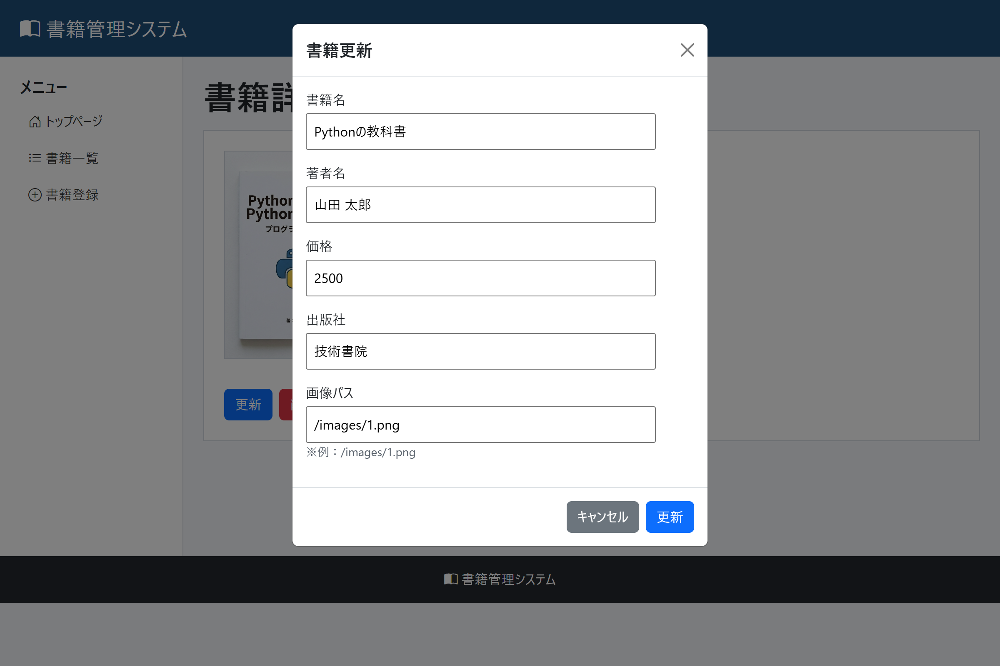

</div>

---

<div class="layout-diagram-block">

#### SCR-006 書籍削除Modal

書籍詳細画面の「削除」ボタンをクリックすると表示される削除確認Modalです。削除対象の書籍名が表示されます。

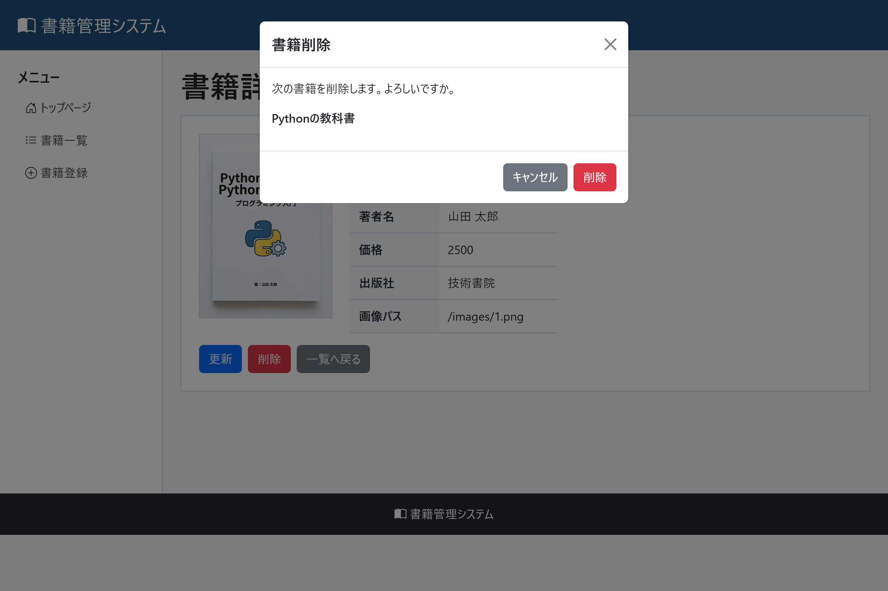

</div>

---

<div class="layout-diagram-block">

#### SCR-003 書籍登録画面（初期表示）

サイドバーの「書籍登録」をクリックした直後の画面です。書籍名、著者名、価格、出版社、画像パスの入力欄と「登録」ボタンがあります。

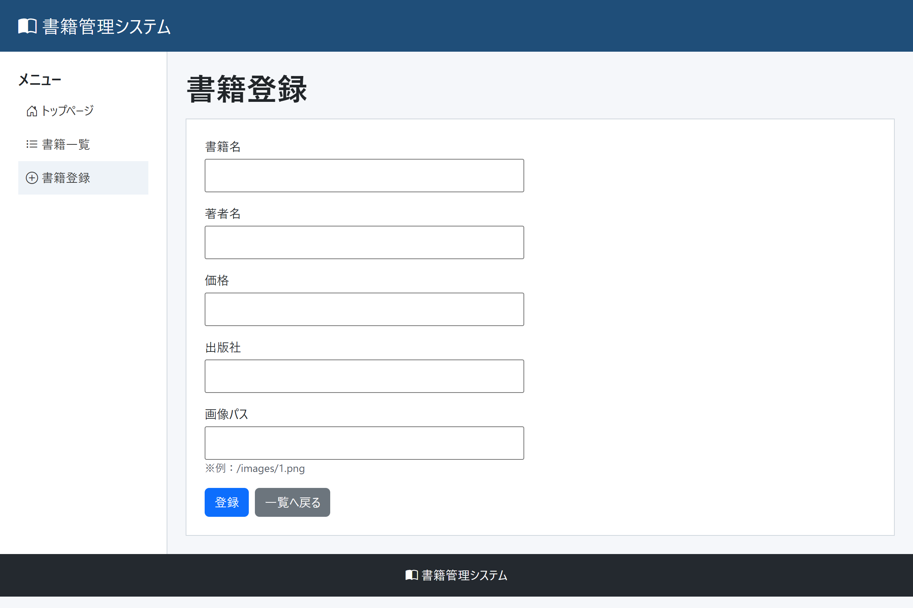

</div>

---

<div class="layout-diagram-block">

#### SCR-003 書籍登録画面（入力エラー）

必須項目（書籍名、著者名、価格）が未入力のまま「登録」ボタンを押した場合の画面です。「データを入力してください。」というエラーメッセージが表示されます。

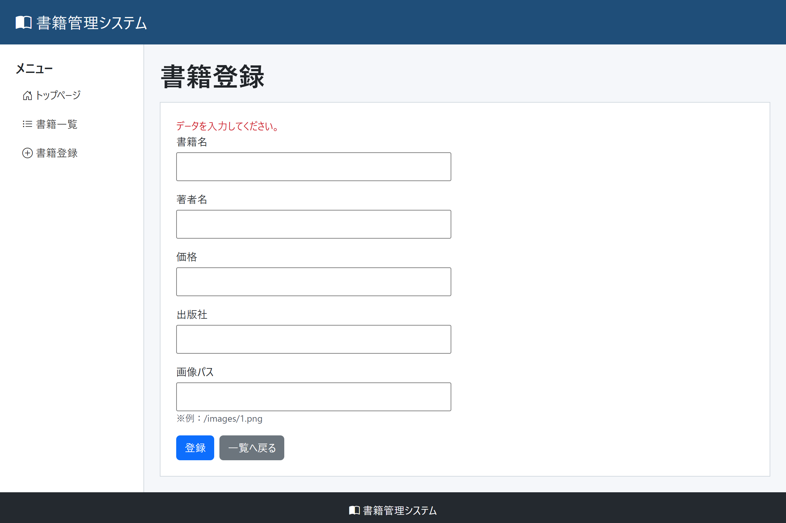

</div>

## 6. データベース仕様

### 6.1 テーブル定義

テーブル名: `books`

| カラム名 | 論理名 | データ型 | 制約 | 説明 |
|---|---|---|---|---|
| `id` | 書籍ID | INTEGER | PRIMARY KEY AUTOINCREMENT | 書籍を識別する番号 |
| `title` | 書籍名 | TEXT | NOT NULL | 書籍のタイトル |
| `author` | 著者名 | TEXT | NOT NULL | 著者名 |
| `price` | 価格 | INTEGER | NOT NULL | 書籍価格 |
| `publisher` | 出版社 | TEXT | なし | 出版社名 |
| `image_path` | 画像パス | TEXT | なし | 表紙画像のパス |

### 6.2 追加機能用テーブル定義

テーブル名: `users`

ログイン機能と権限管理は追加機能の候補として扱います。そのため、スターターキットのSQLには、追加機能で使用する `users` テーブルも用意します。基本機能の実装では、このテーブルを使用しません。

| カラム名 | 論理名 | データ型 | 制約 | 説明 |
|---|---|---|---|---|
| `id` | ユーザーID | INTEGER | PRIMARY KEY AUTOINCREMENT | ユーザーを識別する番号 |
| `login_id` | ログインID | TEXT | NOT NULL UNIQUE | ログイン時に入力するID |
| `password` | パスワード | TEXT | NOT NULL | ログイン時に入力するパスワード |
| `name` | ユーザー名 | TEXT | NOT NULL | 画面表示用の名前 |
| `role` | 権限 | TEXT | NOT NULL | `admin` または `user` を想定 |

### 6.3 必須項目

登録・更新時は、次の項目を必須とします。

| 項目 | 理由 |
|---|---|
| `title` | 一覧・詳細で主要情報として表示するため |
| `author` | 書籍情報として基本項目のため |
| `price` | 数値入力とAPI送信の練習に使用するため |

### 6.4 初期データ

`books` テーブルには、スターターキットの `images` フォルダに用意された画像ファイルと対応する初期データを登録します。

| id | 書籍名 | 著者名 | 価格 | 出版社 | 画像パス |
|---|---|---|---|---|---|
| 1 | Pythonの教科書 | 山田 太郎 | 2500 | 技術書院 | `/images/1.png` |
| 2 | Vue.js入門 | 山田 太郎 | 3000 | 技術評論社 | `/images/2.png` |
| 3 | Django開発 | 佐藤 健一 | 2800 | 技術評論社 | `/images/3.png` |
| 4 | JavaScript完全 | 山田 太郎 | 3200 | 技術評論社 | `/images/4.png` |
| 5 | AIの基礎 | 田中 未来 | 3500 | 未来技術社 | `/images/5.png` |
| 6 | React実践 | 伊藤 さくら | 3100 | 技術評論社 | `/images/6.png` |
| 7 | Go言語 | 渡辺 剛 | 3400 | 技術評論社 | `/images/7.png` |
| 8 | Docker活用 | 山田 太郎 | 2900 | クラウド書房 | `/images/8.png` |
| 9 | AWS構築 | 山田 太郎 | 3800 | インフラ技術社 | `/images/9.png` |
| 10 | アジャイル | 吉田 チーム | 2600 | J-TECH | `/images/10.png` |

## 7. API仕様

| メソッド | URL | 概要 | 使用するSQL |
|---|---|---|---|
| GET | `/api/v1/books` | 書籍一覧取得 | `SELECT * FROM books` |
| GET | `/api/v1/books?keyword=xxx` | 書籍名検索 | `SELECT * FROM books WHERE title LIKE ?` |
| GET | `/api/v1/books/:id` | 書籍詳細取得 | `SELECT * FROM books WHERE id = ?` |
| POST | `/api/v1/books` | 書籍登録 | `INSERT INTO books ...` |
| PUT | `/api/v1/books/:id` | 書籍更新 | `UPDATE books SET ... WHERE id = ?` |
| DELETE | `/api/v1/books/:id` | 書籍削除 | `DELETE FROM books WHERE id = ?` |

## 8. 実装順序

### 8.1 API

1. Express、JSON受信、CORS、SQLite接続を設定する。
2. `GET /api/v1/books` を実装する。
3. `keyword` クエリパラメータによる検索を追加する。
4. `GET /api/v1/books/:id` を実装する。
5. `POST /api/v1/books` を実装する。
6. `PUT /api/v1/books/:id` を実装する。
7. `DELETE /api/v1/books/:id` を実装する。
8. 疑似画面のURLはNavigation APIで切り替える。サーバー側で疑似画面URL用のHTML返却処理は追加しない。

### 8.2 フロントエンド

1. `app.js` に各コンポーネントのimportを追加する。
2. `showPage(path)` でURLと表示関数を対応させる。
3. `book-list.js` で一覧表示と検索を実装する。
4. `book-detail.js` で詳細表示、更新ボタン、削除ボタンを実装する。
5. `book-register.js` で登録フォームとPOST処理を実装する。
6. `book-update-modal.js` で更新ModalとPUT処理を実装する。
7. `book-delete-modal.js` で削除確認ModalとDELETE処理を実装する。

トップページはスターターキットで実装済みの `home.js` を確認します。基本機能では、システム概要、主要操作ボタン、機能案内、Bootstrap Iconsの使い方を確認します。追加機能として登録書籍数や最近登録された書籍を表示する場合は、トップページ用APIと `home.js` のAPI通信処理を追加します。

## 9. 動作確認

### 9.1 起動方法

本演習では、フロントエンド画面とAPIサーバーを別々に起動します。

#### APIサーバーを起動する

`BookProject/api` フォルダで次のコマンドを実行します。

```bash
npm start
```

起動できたら、ブラウザで次のURLを開きます。

```text
http://localhost:3015/api/test
```

次のようなJSONが表示されれば、APIサーバーは起動できています。

```json
{
  "status": "ok",
  "message": "APIサーバー稼働中！"
}
```

#### フロントエンド画面を起動する

フロントエンド画面は、Visual Studio CodeのLive Serverで確認します。

このとき、必ず `BookProject` フォルダをLive Serverで開いてください。

正しいURLの形:

```text
http://127.0.0.1:ポート番号/
```

ポート番号は環境によって変わります。多くの場合は `5500` ですが、すでに別のLive Serverが起動している場合は `5501`、`5502` などになることがあります。

そのため、`http://127.0.0.1:5500/` を手入力するのではなく、`Open with Live Server` を実行した時にブラウザで自動的に開かれたURLを使用してください。

正しく開けている場合、ブラウザのURLは `/basic_answer/` や `/starter-kit/BookProject/` ではなく、Live Serverのルート `/` になります。

次のようなURLで開いている場合は、Live Serverで開くフォルダが違います。

```text
http://127.0.0.1:5500/basic_answer/
http://127.0.0.1:5501/starter-kit/BookProject/
```

この状態では、`/css/style.css` や `/js/app.js` の読み込み先がずれて、CSSが適用されなかったり、メニューをクリックした時に `Cannot GET /books` と表示されたりします。

#### 正しい開き方

1. Visual Studio Codeで `BookProject` フォルダを開く。
2. `index.html` を右クリックする。
3. `Open with Live Server` を選択する。
4. ブラウザが自動的に開いたURLを確認する。
5. URLの末尾が `/` または `/index.html` になっていることを確認する。
6. URLに `/basic_answer/` や `/starter-kit/BookProject/` が含まれていないことを確認する。
7. 別ターミナルでAPIサーバーが起動していることを確認する。

### 9.2 基本機能の確認

| 確認項目 | 期待結果 |
|---|---|
| Live Serverで `BookProject` を開く | Live Serverが開いたURLでトップページが表示される |
| `http://localhost:3015/api/test` を開く | APIサーバーの起動確認用JSONが表示される |
| トップページから「書籍一覧」をクリックする | 書籍一覧が表示される |
| 検索欄にキーワードを入力する | 書籍名に一致する一覧が表示される |
| 一覧から詳細リンクをクリックする | URLが `/books/{id}` になり、詳細画面が表示される |
| メニューから「書籍登録」をクリックする | 登録画面が表示される |
| 必須項目を入力して登録する | 書籍が登録され、一覧へ移動する |
| 詳細画面で更新ボタンを押す | 更新Modalが表示される |
| 更新Modalで更新する | Modalが閉じ、詳細画面が再読み込みされる |
| 詳細画面で削除ボタンを押す | 削除確認Modalが表示される |
| 削除を確定する | Modalが閉じ、一覧へ移動する |
| モバイル幅で三本線ボタンを押す | モバイルメニューが表示される |

## 10. 追加課題

基本機能の実装が完了した後、時間に余裕がある場合は次の追加課題に取り組みます。

| 課題 | 内容 |
|---|---|
| 並び替え | 価格の昇順・降順で一覧を並び替える |
| 画像プレビュー | 登録画面で画像パス入力後にプレビューを表示する |
| 入力チェック強化 | 価格が0以下の場合にエラーを表示する |
| メッセージ改善 | 登録・更新・削除後のメッセージを画面内に表示する |
| トップページ情報表示 | 登録書籍数と最近登録された書籍をトップページに表示する |
| ログイン機能 | ユーザーIDとパスワードでログインできるようにする |
| 権限管理 | `role` によって利用できる機能を制御する |

### 10.1 並び替え

#### 目的

書籍一覧画面で、価格の昇順・降順を切り替えて表示できるようにします。

#### 対象画面

| 項目 | 内容 |
|---|---|
| 対象画面 | 書籍一覧画面 |
| 対象ファイル | `js/components/book-list.js`, `api/server.js` |
| 対象API | `GET /api/v1/books` |

#### 仕様

| 項目 | 内容 |
|---|---|
| 並び替え条件 | 価格 |
| 並び順 | 昇順、降順 |
| 初期表示 | 指定なし。基本機能と同じ一覧を表示する。 |
| 操作方法 | 書籍一覧画面に並び替え用の選択欄またはボタンを追加する。 |
| APIパラメータ例 | `GET /api/v1/books?sort=price_asc`、`GET /api/v1/books?sort=price_desc` |

#### 実装方針

1. 書籍一覧画面に並び替え操作用の要素を追加する。
2. 並び替え条件を取得する。
3. AxiosでAPIを呼び出す時に、並び替え条件をクエリパラメータとして送信する。
4. API側で `ORDER BY price ASC` または `ORDER BY price DESC` を使って検索する。
5. 取得した結果で一覧を再表示する。

#### 完了条件

| 確認内容 | 期待結果 |
|---|---|
| 価格の昇順を選択する | 価格が安い順に表示される。 |
| 価格の降順を選択する | 価格が高い順に表示される。 |
| 検索と組み合わせる | 検索結果に対して並び替えが適用される。 |

<div class="layout-diagram-block">

#### 動作確認画面イメージ

価格の昇順・降順を切り替えて「並び替え」ボタンを押すことで、指定された順序で一覧が再描画されます。

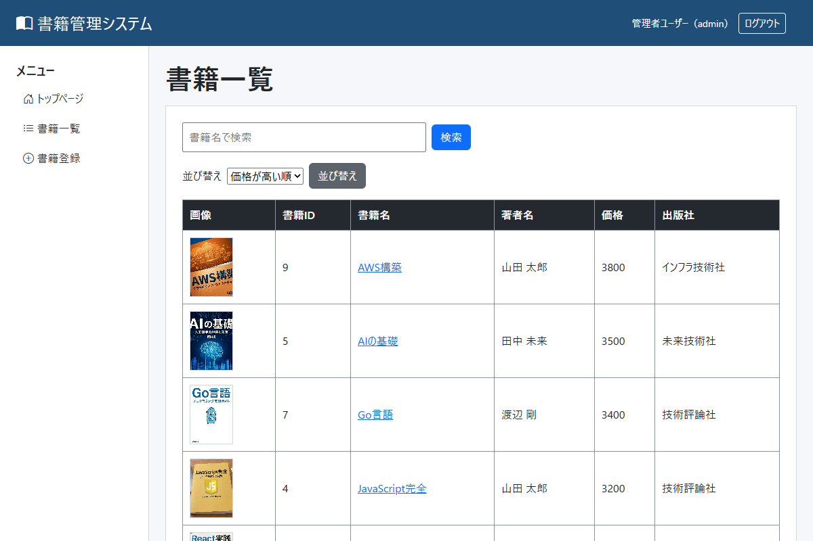

</div>

### 10.2 画像プレビュー

#### 目的

書籍登録画面で画像パスを入力した時に、登録前に表紙画像を確認できるようにします。

#### 対象画面

| 項目 | 内容 |
|---|---|
| 対象画面 | 書籍登録画面 |
| 対象ファイル | `js/components/book-register.js` |
| 対象API | なし |

#### 仕様

| 項目 | 内容 |
|---|---|
| 入力対象 | 画像パス入力欄 |
| 表示対象 | 入力された画像パスの画像 |
| 表示位置 | 画像パス入力欄の近く |
| 画像が表示できない場合 | 画像を表示せず、入力値を確認するよう案内する。 |
| 入力例 | `/images/1.png` |

#### 実装方針

1. 登録画面に画像プレビュー用の `img` 要素を追加する。
2. 画像パス入力欄に `input` イベントを設定する。
3. 入力値が変わったら、`img` 要素の `src` 属性へ入力値を設定する。
4. 入力値が空の場合は、プレビューを非表示にする。

#### 完了条件

| 確認内容 | 期待結果 |
|---|---|
| `/images/1.png` を入力する | 1.pngの画像が表示される。 |
| 画像パスを空にする | プレビュー画像が表示されない。 |
| 存在しない画像パスを入力する | 画面が崩れず、登録フォームの操作を続けられる。 |

<div class="layout-diagram-block">

#### 動作確認画面イメージ

画像パスを入力すると、その場で書籍登録フォーム内に画像プレビューがリアルタイムに表示されます。

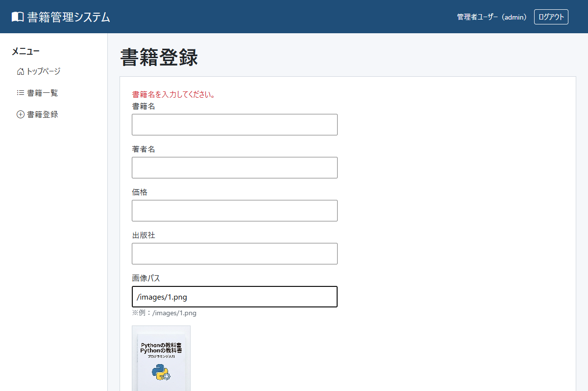

</div>

### 10.3 入力チェック強化

#### 目的

必須チェックだけでなく、入力値の内容が正しいか確認できるようにします。

#### 対象画面

| 項目 | 内容 |
|---|---|
| 対象画面 | 書籍登録画面、書籍更新Modal |
| 対象ファイル | `book-register.js`, `book-update-modal.js`, `api/server.js` |
| 対象API | `POST /api/v1/books`, `PUT /api/v1/books/:id` |

#### 仕様

| チェック対象 | 条件 | エラーメッセージ例 |
|---|---|---|
| 書籍名 | 空欄不可 | 書籍名を入力してください。 |
| 著者名 | 空欄不可 | 著者名を入力してください。 |
| 価格 | 空欄不可 | 価格を入力してください。 |
| 価格 | 1以上の数値 | 価格は1以上の数値を入力してください。 |
| 画像パス | 任意 | 未入力でも登録可能。 |

#### 実装方針

1. 登録処理と更新処理の前に入力値を確認する。
2. エラーがある場合はAPIを呼び出さず、画面にメッセージを表示する。
3. API側でも同じ観点でチェックする。
4. API側でエラーになった場合は、400 Bad Requestを返す。

#### 完了条件

| 確認内容 | 期待結果 |
|---|---|
| 価格に0を入力する | エラーが表示され、登録・更新されない。 |
| 価格に負の数を入力する | エラーが表示され、登録・更新されない。 |
| 必須項目をすべて入力する | 登録・更新できる。 |

<div class="layout-diagram-block">

#### 動作確認画面イメージ

必須入力項目が抜けているなどエラーがある場合、エラーメッセージが赤字で画面内に表示され、API通信（登録）は実行されません。

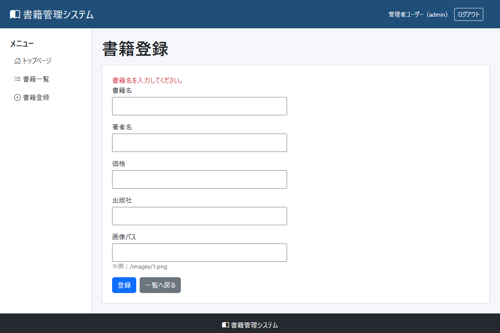

</div>

### 10.4 メッセージ改善

#### 目的

`alert()` だけに頼らず、登録・更新・削除の結果を画面内に表示できるようにします。

#### 対象画面

| 項目 | 内容 |
|---|---|
| 対象画面 | 書籍一覧画面、書籍登録画面、書籍詳細画面、書籍更新Modal、書籍削除Modal |
| 対象ファイル | `book-list.js`, `book-register.js`, `book-detail.js`, `book-update-modal.js`, `book-delete-modal.js` |
| 対象API | 書籍管理API全般 |

#### 仕様

| 操作 | メッセージ例 | 表示場所 |
|---|---|---|
| 登録成功 | 書籍を登録しました。 | 書籍一覧画面上部 |
| 更新成功 | 書籍を更新しました。 | 書籍詳細画面上部 |
| 削除成功 | 書籍を削除しました。 | 書籍一覧画面上部 |
| 入力エラー | 入力内容を確認してください。 | フォームまたはModal内 |
| 通信エラー | 通信に失敗しました。時間をおいて再実行してください。 | 操作中の画面 |

#### 実装方針

1. メッセージ表示用の領域を用意する。
2. 成功時・失敗時に表示する文言を決める。
3. 画面移動後にメッセージを表示する場合は、必要に応じて一時的に値を保持する。
4. エラー時は、コンソール出力だけでなく画面にもメッセージを表示する。

#### 完了条件

| 確認内容 | 期待結果 |
|---|---|
| 登録に成功する | 書籍一覧画面に成功メッセージが表示される。 |
| 更新に成功する | 書籍詳細画面に成功メッセージが表示される。 |
| 削除に成功する | 書籍一覧画面に成功メッセージが表示される. |
| API通信に失敗する | 画面にエラーメッセージが表示される。 |

<div class="layout-diagram-block">

#### 動作確認画面イメージ

登録成功後には画面遷移先の一覧画面上部に、「書籍を登録しました。」という旨の完了メッセージが表示されます。

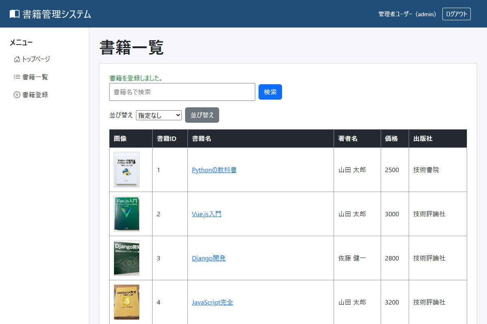

</div>

### 10.5 トップページ情報表示

#### 目的

トップページに登録書籍数と最近登録された書籍を表示し、アプリの状態を確認できるようにします。

#### 対象画面

| 項目 | 内容 |
|---|---|
| 対象画面 | トップページ |
| 対象ファイル | `home.js`, `api/server.js` |
| 対象API | `GET /api/v1/books/summary` など |

#### 仕様

| 表示項目 | 内容 |
|---|---|
| 登録書籍数 | `books` テーブルに登録されている件数 |
| 最近登録された書籍 | IDが大きい順に数件表示する |
| 表示件数 | 3件程度 |
| 0件の場合 | 「登録されている書籍はありません。」と表示する |

#### API仕様案

| メソッド | URL | 概要 |
|---|---|---|
| GET | `/api/v1/books/summary` | 登録書籍数と最近登録された書籍を取得する |

レスポンス例:

```json
{
  "count": 10,
  "recentBooks": [
    { "id": 10, "title": "アジャイル", "author": "吉田 チーム" },
    { "id": 9, "title": "AWS構築", "author": "山田 太郎" },
    { "id": 8, "title": "Docker活用", "author": "山田 太郎" }
  ]
}
```

#### 実装方針

1. API側にトップページ情報取得用のエンドポイントを追加する。
2. `COUNT(*)` で登録書籍数を取得する。
3. `ORDER BY id DESC LIMIT 3` で最近登録された書籍を取得する。
4. `home.js` でAPIを呼び出し、トップページへ表示する。

#### 完了条件

| 確認内容 | 期待結果 |
|---|---|
| トップページを表示する | 登録書籍数が表示される。 |
| トップページを表示する | 最近登録された書籍が表示される。 |
| 書籍を新規登録する | トップページの件数と最近登録された書籍が変わる。 |

<div class="layout-diagram-block">

#### 動作確認画面イメージ

トップページ上に、システム内の登録書籍総数および、最近登録された最新3件の書籍リストが表示されます。

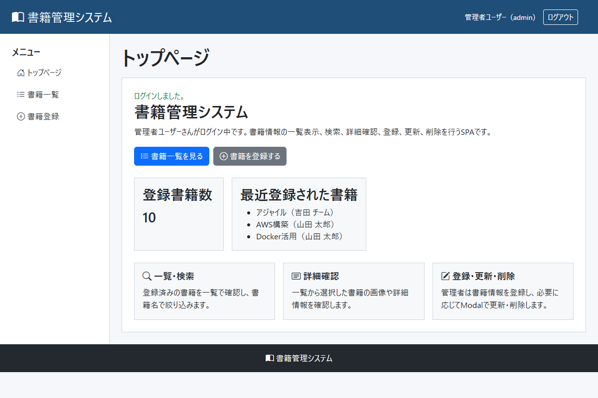

</div>

### 10.6 ログイン機能

#### 目的

利用者がログインIDとパスワードを入力し、システムにログインできるようにします。

#### 対象画面

| 項目 | 内容 |
|---|---|
| 対象画面 | ログイン画面、トップページ |
| 対象ファイル | `login.js`, `home.js`, `app.js`, `api/server.js` |
| 対象テーブル | `users` |
| 対象API | `POST /api/v1/login` など |

#### 仕様

| 項目 | 内容 |
|---|---|
| ログインID | `users.login_id` と照合する |
| パスワード | `users.password` と照合する |
| ログイン成功 | トップページへ移動する |
| ログイン失敗 | ログイン画面にエラーメッセージを表示する |
| ログイン状態 | 学習用の簡易実装として、ブラウザ側にログイン中ユーザー情報を保持する |

#### API仕様案

| メソッド | URL | 概要 |
|---|---|---|
| POST | `/api/v1/login` | ログインIDとパスワードを確認する |

リクエスト例:

```json
{
  "login_id": "admin",
  "password": "admin123"
}
```

レスポンス例:

```json
{
  "id": 1,
  "login_id": "admin",
  "name": "管理者ユーザー",
  "role": "admin"
}
```

#### 実装方針

1. ログイン画面を追加する。
2. `users` テーブルからログインIDに一致するユーザーを取得する。
3. パスワードが一致するか確認する。
4. 一致した場合は、ユーザー情報を返す。
5. 画面側でログイン中ユーザー情報を保持する。
6. トップページにログイン中ユーザー名を表示する。

#### 完了条件

| 確認内容 | 期待結果 |
|---|---|
| 正しいログインIDとパスワードを入力する | ログインでき、トップページへ移動する。 |
| 間違ったパスワードを入力する | エラーメッセージが表示される。 |
| ログイン後のトップページを表示する | ログイン中ユーザー名が表示される。 |

<div class="layout-diagram-block">

#### 動作確認画面イメージ

セッション管理およびログイン認証のためのログイン画面です。ログインに成功すると、保持されたロールでシステムを利用できます。

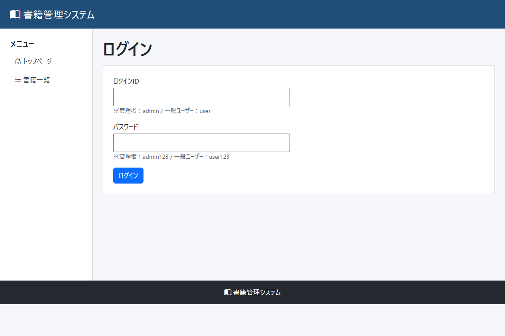

</div>

### 10.7 権限管理

#### 目的

`users.role` の値に応じて、利用できる機能を制御できるようにします。

#### 対象画面

| 項目 | 内容 |
|---|---|
| 対象画面 | トップページ、書籍一覧画面、書籍詳細画面、書籍登録画面 |
| 対象ファイル | `app.js`, `home.js`, `book-detail.js`, `book-register.js`, `book-update-modal.js`, `book-delete-modal.js` |
| 対象テーブル | `users` |
| 対象列 | `role` |

#### 仕様

| role | 利用できる機能 |
|---|---|
| `admin` | 一覧、検索、詳細、登録、更新、削除 |
| `user` | 一覧、検索、詳細 |

#### 画面制御

| 画面・操作 | admin | user |
|---|---|---|
| 書籍一覧表示 | ○ | ○ |
| 書籍検索 | ○ | ○ |
| 書籍詳細表示 | ○ | ○ |
| 書籍登録 | ○ | × |
| 書籍更新 | ○ | × |
| 書籍削除 | ○ | × |

#### 実装方針

1. ログイン中ユーザーの `role` を取得する。
2. `role` が `user` の場合は、書籍登録メニューを表示しない。
3. `role` が `user` の場合は、詳細画面の更新・削除ボタンを表示しない。
4. 不正に登録画面へ移動しようとした場合は、トップページまたは一覧画面へ戻す。
5. API側でも必要に応じて `role` を確認する。

#### 完了条件

| 確認内容 | 期待結果 |
|---|---|
| adminでログインする | 登録、更新、削除が利用できる。 |
| userでログインする | 登録、更新、削除が表示されない。 |
| userで登録画面へ移動しようとする | 登録画面を利用できない。 |
| userで一覧・検索・詳細を使う | 問題なく利用できる。 |

<div class="layout-diagram-block">

#### 動作確認画面イメージ

一般ユーザー（user）権限でログインした場合、メニューからの「書籍登録」非表示化に加え、詳細画面における「更新」および「削除」ボタンが非表示になります。

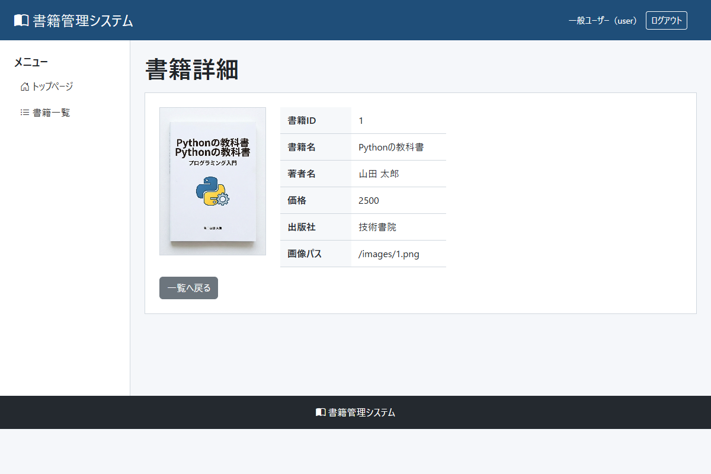

</div>

